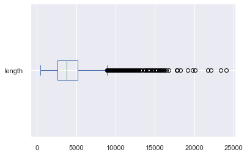
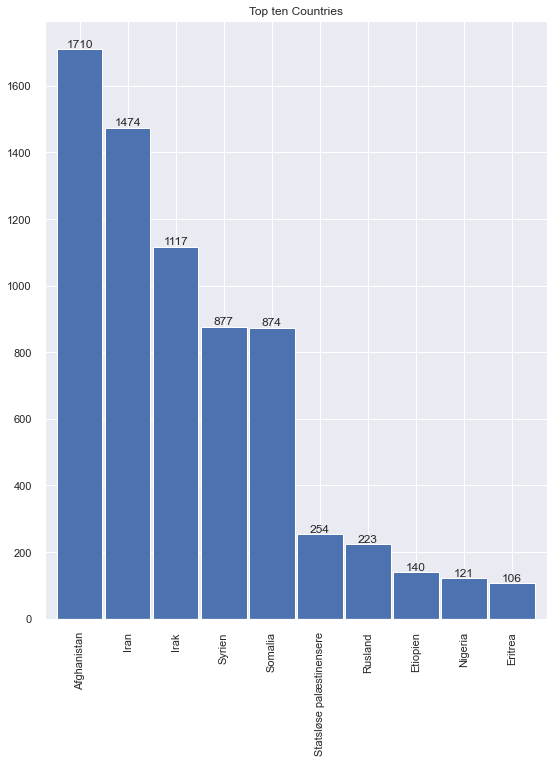
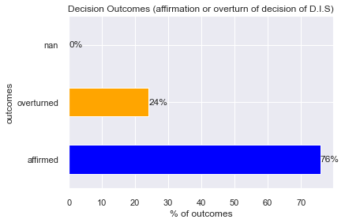
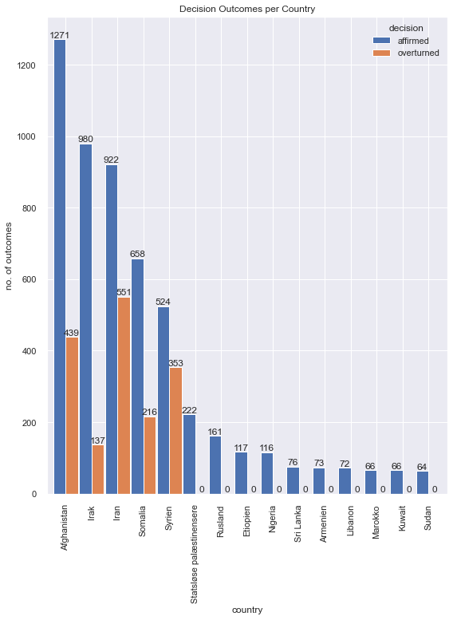
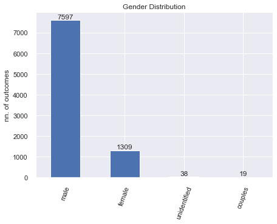
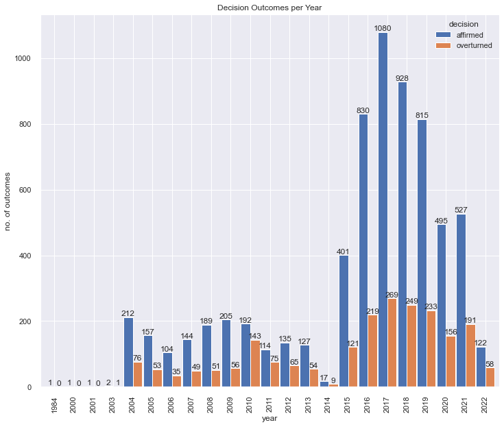
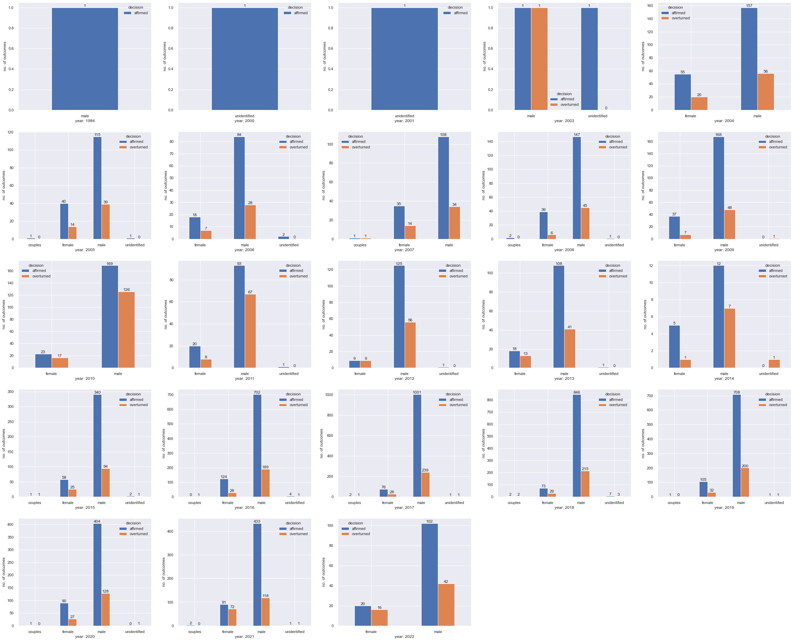
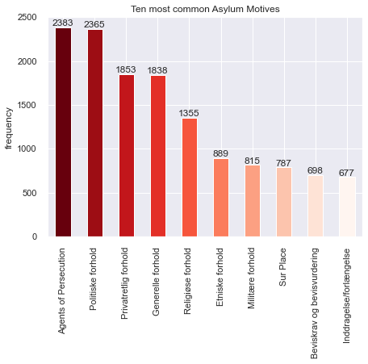
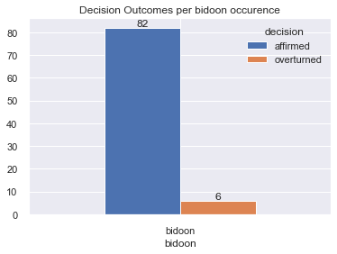

# ALL cases EDA:

# Import data set:

    (9635, 5)

# Dataset preprocessing:

Keep ALL cases except for Unknown Homeland (Ukendt hjemland):

    (9443, 4)

<table border="1" class="dataframe">
  <thead>
    <tr style="text-align: right;">
      <th></th>
      <th>id</th>
      <th>asylum_motive</th>
      <th>country</th>
      <th>text</th>
    </tr>
  </thead>
  <tbody>
    <tr>
      <th>0</th>
      <td>0</td>
      <td>[Statusændring,  Privatretlig forhold,  Øvrige...</td>
      <td>Syrien</td>
      <td>Nævnet omgjorde i maj 2022 Udlændinges...</td>
    </tr>
    <tr>
      <th>1</th>
      <td>1</td>
      <td>[To-instansbehandling,  Bortfald]</td>
      <td>Syrien</td>
      <td>Nævnet hjemviste i november 2021 Udlæn...</td>
    </tr>
    <tr>
      <th>2</th>
      <td>2</td>
      <td>[Statusændring,  Militære forhold]</td>
      <td>Eritrea</td>
      <td>Nævnet omgjorde i maj 2022 Udlændinges...</td>
    </tr>
    <tr>
      <th>3</th>
      <td>3</td>
      <td>[Generelle forhold,  Privatretlig forhold]</td>
      <td>Afghanistan</td>
      <td>Nævnet stadfæstede i maj 2022 Udlændin...</td>
    </tr>
    <tr>
      <th>4</th>
      <td>4</td>
      <td>[Kriminelle forhold,  Privatretlig forhold,  S...</td>
      <td>Afghanistan</td>
      <td>Nævnet stadfæstede i maj 2022 Udlændin...</td>
    </tr>
  </tbody>
</table>

Check for potential duplicates and drop them:

<table border="1" class="dataframe">
  <thead>
    <tr style="text-align: right;">
      <th></th>
      <th>id</th>
      <th>asylum_motive</th>
      <th>country</th>
      <th>text</th>
    </tr>
  </thead>
  <tbody>
    <tr>
      <th>131</th>
      <td>131</td>
      <td>[Generelle forhold,  Øvrige modsætningsforhold...</td>
      <td>Syrien</td>
      <td>Nævnet omgjorde i november 2021 Udlænd...</td>
    </tr>
    <tr>
      <th>132</th>
      <td>132</td>
      <td>[Generelle forhold,  Øvrige modsætningsforhold...</td>
      <td>Syrien</td>
      <td>Nævnet omgjorde i november 2021 Udlænd...</td>
    </tr>
    <tr>
      <th>521</th>
      <td>521</td>
      <td>[Udsendelse (§ 49 a m.v.),  Sur Place,  Privat...</td>
      <td>Afghanistan</td>
      <td>Nævnet stadfæstede i juli 2021 Udlændi...</td>
    </tr>
    <tr>
      <th>1098</th>
      <td>1098</td>
      <td>[Konsekvensstatus,  Statusændring,  Politiske ...</td>
      <td>Syrien</td>
      <td>Nævnet meddelte i oktober 2020 opholds...</td>
    </tr>
    <tr>
      <th>1142</th>
      <td>1142</td>
      <td>[Seksuelle forhold,  Overgreb,  Etniske forhol...</td>
      <td>Den Demokratiske Republik Congo (DR Congo)</td>
      <td>Nævnet stadfæstede i september 2020 Ud...</td>
    </tr>
    <tr>
      <th>...</th>
      <td>...</td>
      <td>...</td>
      <td>...</td>
      <td>...</td>
    </tr>
    <tr>
      <th>9388</th>
      <td>9388</td>
      <td>[Politiske forhold,  Agents of Persecution,  T...</td>
      <td>Afghanistan</td>
      <td>Nævnet meddelte i juli 2010 opholdstilladelse ...</td>
    </tr>
    <tr>
      <th>9582</th>
      <td>9582</td>
      <td>[Politiske forhold]</td>
      <td>Afghanistan</td>
      <td>Nævnet stadfæstede i juni 2005 Udlændi...</td>
    </tr>
    <tr>
      <th>9594</th>
      <td>9594</td>
      <td>[Privatretlig forhold]</td>
      <td>Afghanistan</td>
      <td>Nævnet stadfæstede i december 2005 Udl...</td>
    </tr>
    <tr>
      <th>9602</th>
      <td>9602</td>
      <td>[Politiske forhold]</td>
      <td>Afghanistan</td>
      <td>Nævnet stadfæstede i april 2004 en afg...</td>
    </tr>
    <tr>
      <th>9607</th>
      <td>9607</td>
      <td>[Konsekvensstatus,  Politiske forhold,  Tortur]</td>
      <td>Afghanistan</td>
      <td>Nævnet meddelte i august 2004 opholdst...</td>
    </tr>
  </tbody>
</table>

480 rows × 4 columns

See shape of new data frame:

    (8963, 4)

## Length of texts

Create a numeric column in order to get a feel about the length of the texts. 

<table border="1" class="dataframe">
  <thead>
    <tr style="text-align: right;">
      <th></th>
      <th>count</th>
      <th>mean</th>
      <th>std</th>
      <th>min</th>
      <th>25%</th>
      <th>50%</th>
      <th>75%</th>
      <th>max</th>
    </tr>
  </thead>
  <tbody>
    <tr>
      <th>id</th>
      <td>8963.0</td>
      <td>4825.259846</td>
      <td>2830.033440</td>
      <td>0.0</td>
      <td>2307.5</td>
      <td>4858.0</td>
      <td>7343.5</td>
      <td>9634.0</td>
    </tr>
    <tr>
      <th>length</th>
      <td>8963.0</td>
      <td>4159.678456</td>
      <td>2212.306528</td>
      <td>407.0</td>
      <td>2636.0</td>
      <td>3771.0</td>
      <td>5153.5</td>
      <td>24044.0</td>
    </tr>
  </tbody>
</table>

## Boxplot:

    <AxesSubplot:>

    

    

# Text Processing:

Column `text` is processed in order to extract data concerning:
- decision outcome
- gender of applicants
- year of decision

Steps included in the pipeline:
- lower casing
- punctuation removal
- stopword removal
- single letter word removal
- tokenization
- lemmatization

See ten first entries

<table border="1" class="dataframe">
  <thead>
    <tr style="text-align: right;">
      <th></th>
      <th>id</th>
      <th>asylum_motive</th>
      <th>country</th>
      <th>text</th>
      <th>length</th>
      <th>tokens</th>
      <th>num_tokens</th>
    </tr>
  </thead>
  <tbody>
    <tr>
      <th>0</th>
      <td>0</td>
      <td>[Statusændring,  Privatretlig forhold,  Øvrige...</td>
      <td>Syrien</td>
      <td>Nævnet omgjorde i maj 2022 Udlændinges...</td>
      <td>7751</td>
      <td>[omgjorde, 2022, udlændingestyrels, afgørelse,...</td>
      <td>600</td>
    </tr>
    <tr>
      <th>1</th>
      <td>1</td>
      <td>[To-instansbehandling,  Bortfald]</td>
      <td>Syrien</td>
      <td>Nævnet hjemviste i november 2021 Udlæn...</td>
      <td>2009</td>
      <td>[hjemvise, 2021, udlændingestyrels, afgørelse,...</td>
      <td>147</td>
    </tr>
    <tr>
      <th>2</th>
      <td>2</td>
      <td>[Statusændring,  Militære forhold]</td>
      <td>Eritrea</td>
      <td>Nævnet omgjorde i maj 2022 Udlændinges...</td>
      <td>2670</td>
      <td>[omgjorde, 2022, udlændingestyrels, afgørelse,...</td>
      <td>196</td>
    </tr>
    <tr>
      <th>3</th>
      <td>3</td>
      <td>[Generelle forhold,  Privatretlig forhold]</td>
      <td>Afghanistan</td>
      <td>Nævnet stadfæstede i maj 2022 Udlændin...</td>
      <td>6695</td>
      <td>[stadfæste, 2022, udlændingestyrels, afgørelse...</td>
      <td>573</td>
    </tr>
    <tr>
      <th>4</th>
      <td>4</td>
      <td>[Kriminelle forhold,  Privatretlig forhold,  S...</td>
      <td>Afghanistan</td>
      <td>Nævnet stadfæstede i maj 2022 Udlændin...</td>
      <td>11359</td>
      <td>[stadfæste, 2022, udlændingestyrels, afgørelse...</td>
      <td>899</td>
    </tr>
    <tr>
      <th>5</th>
      <td>5</td>
      <td>[Politiske forhold,  Privatretlig forhold]</td>
      <td>Rwanda</td>
      <td>Nævnet stadfæstede i maj 2022 Udlændin...</td>
      <td>7232</td>
      <td>[stadfæste, 2022, udlændingestyrels, afgørelse...</td>
      <td>471</td>
    </tr>
    <tr>
      <th>6</th>
      <td>6</td>
      <td>[Inddragelse/forlængelse,  Privatretlig forhold]</td>
      <td>Afghanistan</td>
      <td>Nævnet omgjorde i maj 2022 Udlændinges...</td>
      <td>4902</td>
      <td>[omgjorde, 2022, udlændingestyrels, afgørelse,...</td>
      <td>355</td>
    </tr>
    <tr>
      <th>7</th>
      <td>7</td>
      <td>[Øvrige modsætningsforhold til myndighederne, ...</td>
      <td>Syrien</td>
      <td>Nævnet omgjorde i maj 2022 Udlændinges...</td>
      <td>6470</td>
      <td>[omgjorde, 2022, udlændingestyrels, afgørelse,...</td>
      <td>442</td>
    </tr>
    <tr>
      <th>8</th>
      <td>8</td>
      <td>[Udsendelse (§ 49 a m.v.),  Militære forhold, ...</td>
      <td>Iran</td>
      <td>Nævnet stadfæstede i maj 2022 Udlændin...</td>
      <td>4017</td>
      <td>[stadfæste, 2022, udlændingestyrels, afgørelse...</td>
      <td>302</td>
    </tr>
    <tr>
      <th>9</th>
      <td>9</td>
      <td>[Dublin,  Artikel 18 (Den ansvarlige medlemsst...</td>
      <td>Tyskland</td>
      <td>Nævnet stadfæstede i april 2022 Udlænd...</td>
      <td>3971</td>
      <td>[stadfæste, 2022, udlændingestyrels, afgørelse...</td>
      <td>288</td>
    </tr>
  </tbody>
</table>

# Country of Origin:

<table border="1" class="dataframe">
  <thead>
    <tr style="text-align: right;">
      <th></th>
      <th>count</th>
    </tr>
  </thead>
  <tbody>
    <tr>
      <th>Afghanistan</th>
      <td>1710</td>
    </tr>
    <tr>
      <th>Iran</th>
      <td>1474</td>
    </tr>
    <tr>
      <th>Irak</th>
      <td>1117</td>
    </tr>
    <tr>
      <th>Syrien</th>
      <td>877</td>
    </tr>
    <tr>
      <th>Somalia</th>
      <td>874</td>
    </tr>
    <tr>
      <th>...</th>
      <td>...</td>
    </tr>
    <tr>
      <th>Honduras</th>
      <td>1</td>
    </tr>
    <tr>
      <th>Nordkorea</th>
      <td>1</td>
    </tr>
    <tr>
      <th>Island</th>
      <td>1</td>
    </tr>
    <tr>
      <th>Cypern</th>
      <td>1</td>
    </tr>
    <tr>
      <th>Burkina Faso</th>
      <td>1</td>
    </tr>
  </tbody>
</table>

121 rows × 1 columns

Plot top ten countries:

    

    

# Decision extraction:

Plot decision:

    Text(0, 0.5, 'outcomes')

    

    

Plot decision outcome rate by country:

<table border="1" class="dataframe">
  <thead>
    <tr style="text-align: right;">
      <th></th>
      <th></th>
      <th>count</th>
    </tr>
    <tr>
      <th>country</th>
      <th>decision</th>
      <th></th>
    </tr>
  </thead>
  <tbody>
    <tr>
      <th rowspan="2" valign="top"></th>
      <th>affirmed</th>
      <td>39</td>
    </tr>
    <tr>
      <th>overturned</th>
      <td>11</td>
    </tr>
    <tr>
      <th rowspan="2" valign="top">Afghanistan</th>
      <th>affirmed</th>
      <td>1271</td>
    </tr>
    <tr>
      <th>overturned</th>
      <td>439</td>
    </tr>
    <tr>
      <th>Albanien</th>
      <th>affirmed</th>
      <td>14</td>
    </tr>
    <tr>
      <th>...</th>
      <th>...</th>
      <td>...</td>
    </tr>
    <tr>
      <th rowspan="2" valign="top">Zambia</th>
      <th>affirmed</th>
      <td>3</td>
    </tr>
    <tr>
      <th>overturned</th>
      <td>2</td>
    </tr>
    <tr>
      <th rowspan="2" valign="top">Zimbabwe</th>
      <th>overturned</th>
      <td>4</td>
    </tr>
    <tr>
      <th>affirmed</th>
      <td>3</td>
    </tr>
    <tr>
      <th>Østrig</th>
      <th>affirmed</th>
      <td>10</td>
    </tr>
  </tbody>
</table>

187 rows × 1 columns

    

    

# Gender of applicants extraction:

    Text(0, 0.5, 'nn. of outcomes')

    

    

# Year of decision:

    

    

Plot Decision Outcome Frequencies by Gender for each Year:

    

    

# Asylum motives distribution:

    Agents of Persecution                                         2383
    Politiske forhold                                             2365
    Privatretlig forhold                                          1853
    Generelle forhold                                             1838
    Religiøse forhold                                             1355
                                                                  ... 
    Artikel 3                                                        2
    Pas-sager                                                        1
    TagCollectionMotive                                              1
    Artikel 9 (familiemedlemmer med international beskyttelse)       1
    Artikel 8 (uledsagede mindreårige)                               1
    Name: asylum_motive, Length: 65, dtype: int64

Plot ten most frequent asylum motives:

    Text(0, 0.5, 'frequency')

    

    

# Search for specific terms:

- Bidoon:

<table border="1" class="dataframe">
  <thead>
    <tr style="text-align: right;">
      <th></th>
      <th>counts</th>
    </tr>
  </thead>
  <tbody>
    <tr>
      <th>bidoon</th>
      <td>86</td>
    </tr>
    <tr>
      <th>Bidoon</th>
      <td>2</td>
    </tr>
  </tbody>
</table>

Merge categories and count again:

<table border="1" class="dataframe">
  <thead>
    <tr style="text-align: right;">
      <th></th>
      <th>counts</th>
    </tr>
  </thead>
  <tbody>
    <tr>
      <th>bidoon</th>
      <td>88</td>
    </tr>
  </tbody>
</table>

See some context:

    10 random samples out of 467 contexts for 'bidoon':
    irer i Irak og/eller Kuwait. Nævnet forkaster derfor ansøgernes forklaringer om, at de er statsløse  bidoon ere fra Kuwait som utroværdig. Det bemærkes i den forbindelse videre, at ingen af ansøgerne har haft
    stadfæstede i juli 2021 Udlændingestyrelsens afgørelse vedrørende en mandlig asylansøger angiveligt  bidoon  Kuwait. Indrejst 2016.”Ansøgeren er, den angiveligt statsløse bidoon fra Kuwait og som er etnisk ar
        Nævnet stadfæstede i oktober 2018 Udlændingestyrelsens afgørelse vedrørende en mandlig statsløs  bidoon  fra Kuwait. Indrejst i 2015. Flygtningenævnet udtalte: ”Ansøgeren er etnisk araber og sunni-muslim 
    ait samt parrets tre børn. Indrejst i 2015.Flygtningenævnet udtalte:”Ansøgerne har oplyst, at de er  bidoon s (statsløse) fra Suleibiyeh, Kuwait, etniske arabere og shia-muslimer af trosretning. Ansøgerne har
    ner i Kuwait, der er årsag til hans udrejse. Det fremgår af baggrundsoplysninger om situationen for  bidoon er i Kuwait, at etniske bidoonere udsættes for diskrimination, og at de har begrænsede rettigheder. 
    , som efter hans skøn kan få betydning i sagen. Ansøgeren har hertil forklaret, at han som statsløs  bidoon  slet ikke har nogen dokumenter. Nævnet finder herefter ikke, at ansøgerens fremlæggelse af kopier a
    ningenævnet lægger i overensstemmelse med Udlændingestyrelsens afgørelse til grund, at ansøgerne er  bidoon ere fra Kuwait. Flygtningenævnet kan ikke lægge ansøgernes forklaringer om asylmotiver til grund, id
    til fordel for bidooneres rettigheder. Ansøgeren har endvidere henvist til, at han som uregistreret  bidoon  ikke har nogen rettigheder i Kuwait. Ansøgeren har til støtte for sit asylmotiv oplyst, at han fra 
    lygtningenævnet, at det forekommer påfaldende, at ansøgerens far, som ifølge ansøgeren var statsløs  bidoon  fra Kuwait, skulle have været ansat i militæret i Kuwait, inden familien rejste til Irak, da ansøge
     som følge af, at han angiveligt skulle være ateist. Sammenfattende, og da de generelle forhold for  bidoon s i Kuwait ikke er af en sådan karakter, at de kan begrunde asyl, finder Flygtningenævnet ikke, at a

Decision outcomes for bidooners outside Unknown Homeland.

    

    

