# ALL cases EDA:

In this part of the analysis the same methodology was used as with the cases for Unknown Homeland. The main difference was that we kept all cases except for Unknown Homeland (Ukendt hjemland), i.e. we looked into text summaries which were annotated other than Unknown Homeland. We were left with a dataset of **9443** with 4 columns, as shown in the following table.

<table border="1" class="dataframe">
  <thead>
    <tr style="text-align: right;">
      <th>id</th>
      <th>asylum_motive</th>
      <th>country</th>
      <th>text</th>
    </tr>
  </thead>
  <tbody>
    <tr>
      <td>0</td>
      <td>[Statusændring,  Privatretlig forhold,  Øvrige...</td>
      <td>Syrien</td>
      <td>Nævnet omgjorde i maj 2022 Udlændinges...</td>
    </tr>
    <tr>
      <td>1</td>
      <td>[To-instansbehandling,  Bortfald]</td>
      <td>Syrien</td>
      <td>Nævnet hjemviste i november 2021 Udlæn...</td>
    </tr>
    <tr>
      <td>2</td>
      <td>[Statusændring,  Militære forhold]</td>
      <td>Eritrea</td>
      <td>Nævnet omgjorde i maj 2022 Udlændinges...</td>
    </tr>
    <tr>
      <td>3</td>
      <td>[Generelle forhold,  Privatretlig forhold]</td>
      <td>Afghanistan</td>
      <td>Nævnet stadfæstede i maj 2022 Udlændin...</td>
    </tr>
    <tr>
      <td>4</td>
      <td>[Kriminelle forhold,  Privatretlig forhold,  S...</td>
      <td>Afghanistan</td>
      <td>Nævnet stadfæstede i maj 2022 Udlændin...</td>
    </tr>
  </tbody>
</table>

## Dataset processing:

Once more, we checked for potential duplicates and dropped them.

<table border="1" class="dataframe">
  <thead>
    <tr style="text-align: right;">
      <th>id</th>
      <th>asylum_motive</th>
      <th>country</th>
      <th>text</th>
    </tr>
  </thead>
  <tbody>
    <tr>
      <td>131</td>
      <td>[Generelle forhold,  Øvrige modsætningsforhold...</td>
      <td>Syrien</td>
      <td>Nævnet omgjorde i november 2021 Udlænd...</td>
    </tr>
    <tr>
      <td>132</td>
      <td>[Generelle forhold,  Øvrige modsætningsforhold...</td>
      <td>Syrien</td>
      <td>Nævnet omgjorde i november 2021 Udlænd...</td>
    </tr>
    <tr>
      <td>521</td>
      <td>[Udsendelse (§ 49 a m.v.),  Sur Place,  Privat...</td>
      <td>Afghanistan</td>
      <td>Nævnet stadfæstede i juli 2021 Udlændi...</td>
    </tr>
    <tr>
      <td>1098</td>
      <td>[Konsekvensstatus,  Statusændring,  Politiske ...</td>
      <td>Syrien</td>
      <td>Nævnet meddelte i oktober 2020 opholds...</td>
    </tr>
    <tr>
      <td>1142</td>
      <td>[Seksuelle forhold,  Overgreb,  Etniske forhol...</td>
      <td>Den Demokratiske Republik Congo (DR Congo)</td>
      <td>Nævnet stadfæstede i september 2020 Ud...</td>
    </tr>
    <tr>
      <td>...</td>
      <td>...</td>
      <td>...</td>
      <td>...</td>
    </tr>
    <tr>
      <td>9388</td>
      <td>[Politiske forhold,  Agents of Persecution,  T...</td>
      <td>Afghanistan</td>
      <td>Nævnet meddelte i juli 2010 opholdstilladelse ...</td>
    </tr>
    <tr>
      <td>9582</td>
      <td>[Politiske forhold]</td>
      <td>Afghanistan</td>
      <td>Nævnet stadfæstede i juni 2005 Udlændi...</td>
    </tr>
    <tr>
      <td>9594</td>
      <td>[Privatretlig forhold]</td>
      <td>Afghanistan</td>
      <td>Nævnet stadfæstede i december 2005 Udl...</td>
    </tr>
    <tr>
      <td>9602</td>
      <td>[Politiske forhold]</td>
      <td>Afghanistan</td>
      <td>Nævnet stadfæstede i april 2004 en afg...</td>
    </tr>
    <tr>
      <td>9607</td>
      <td>[Konsekvensstatus,  Politiske forhold,  Tortur]</td>
      <td>Afghanistan</td>
      <td>Nævnet meddelte i august 2004 opholdst...</td>
    </tr>
  </tbody>
</table>

After dropping 480 duplicate entries the shape of the new data frame was **8963** cases with 4 columns.

## Length of texts

Again, we created a numeric column in order to get a feel about the length of the texts. 

<table border="1" class="dataframe">
  <thead>
    <tr style="text-align: right;">
      <th></th>
      <th>count</th>
      <th>mean</th>
      <th>std</th>
      <th>min</th>
      <th>25%</th>
      <th>50%</th>
      <th>75%</th>
      <th>max</th>
    </tr>
  </thead>
  <tbody>
    <tr>
      <th>length</th>
      <td>8963.0</td>
      <td>4159.678456</td>
      <td>2212.306528</td>
      <td>407.0</td>
      <td>2636.0</td>
      <td>3771.0</td>
      <td>5153.5</td>
      <td>24044.0</td>
    </tr>
  </tbody>
</table>

Here we can see a **Boxplot** visualizing these results.

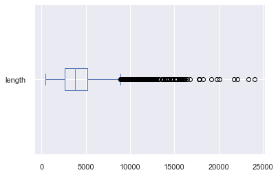
    

## Text Processing:

Same as with Unknown Homeland cases the column labelled as `text` got processed in order to extract data concerning:
- Decision outcome.
- Gender of applicants.
- Year of decision.

Individual steps included in the pipeline were the following:
- Lower casing.
- Punctuation removal.
- Stopword removal.
- Single letter word removal.
- Tokenization.
- Lemmatization.

After processing we were left with a dataset whose ten first entries looked like shown in the table below.

<table border="1" class="dataframe">
  <thead>
    <tr style="text-align: right;">
      <th>id</th>
      <th>asylum_motive</th>
      <th>country</th>
      <th>text</th>
      <th>length</th>
      <th>tokens</th>
      <th>num_tokens</th>
    </tr>
  </thead>
  <tbody>
    <tr>
      <td>0</td>
      <td>[Statusændring,  Privatretlig forhold,  Øvrige...</td>
      <td>Syrien</td>
      <td>Nævnet omgjorde i maj 2022 Udlændinges...</td>
      <td>7751</td>
      <td>[omgjorde, 2022, udlændingestyrels, afgørelse,...</td>
      <td>600</td>
    </tr>
    <tr>
      <td>1</td>
      <td>[To-instansbehandling,  Bortfald]</td>
      <td>Syrien</td>
      <td>Nævnet hjemviste i november 2021 Udlæn...</td>
      <td>2009</td>
      <td>[hjemvise, 2021, udlændingestyrels, afgørelse,...</td>
      <td>147</td>
    </tr>
    <tr>
      <td>2</td>
      <td>[Statusændring,  Militære forhold]</td>
      <td>Eritrea</td>
      <td>Nævnet omgjorde i maj 2022 Udlændinges...</td>
      <td>2670</td>
      <td>[omgjorde, 2022, udlændingestyrels, afgørelse,...</td>
      <td>196</td>
    </tr>
    <tr>
      <td>3</td>
      <td>[Generelle forhold,  Privatretlig forhold]</td>
      <td>Afghanistan</td>
      <td>Nævnet stadfæstede i maj 2022 Udlændin...</td>
      <td>6695</td>
      <td>[stadfæste, 2022, udlændingestyrels, afgørelse...</td>
      <td>573</td>
    </tr>
    <tr>
      <td>4</td>
      <td>[Kriminelle forhold,  Privatretlig forhold,  S...</td>
      <td>Afghanistan</td>
      <td>Nævnet stadfæstede i maj 2022 Udlændin...</td>
      <td>11359</td>
      <td>[stadfæste, 2022, udlændingestyrels, afgørelse...</td>
      <td>899</td>
    </tr>
    <tr>
      <td>5</td>
      <td>[Politiske forhold,  Privatretlig forhold]</td>
      <td>Rwanda</td>
      <td>Nævnet stadfæstede i maj 2022 Udlændin...</td>
      <td>7232</td>
      <td>[stadfæste, 2022, udlændingestyrels, afgørelse...</td>
      <td>471</td>
    </tr>
    <tr>
      <td>6</td>
      <td>[Inddragelse/forlængelse,  Privatretlig forhold]</td>
      <td>Afghanistan</td>
      <td>Nævnet omgjorde i maj 2022 Udlændinges...</td>
      <td>4902</td>
      <td>[omgjorde, 2022, udlændingestyrels, afgørelse,...</td>
      <td>355</td>
    </tr>
    <tr>
      <td>7</td>
      <td>[Øvrige modsætningsforhold til myndighederne, ...</td>
      <td>Syrien</td>
      <td>Nævnet omgjorde i maj 2022 Udlændinges...</td>
      <td>6470</td>
      <td>[omgjorde, 2022, udlændingestyrels, afgørelse,...</td>
      <td>442</td>
    </tr>
    <tr>
      <td>8</td>
      <td>[Udsendelse (§ 49 a m.v.),  Militære forhold, ...</td>
      <td>Iran</td>
      <td>Nævnet stadfæstede i maj 2022 Udlændin...</td>
      <td>4017</td>
      <td>[stadfæste, 2022, udlændingestyrels, afgørelse...</td>
      <td>302</td>
    </tr>
    <tr>
      <td>9</td>
      <td>[Dublin,  Artikel 18 (Den ansvarlige medlemsst...</td>
      <td>Tyskland</td>
      <td>Nævnet stadfæstede i april 2022 Udlænd...</td>
      <td>3971</td>
      <td>[stadfæste, 2022, udlændingestyrels, afgørelse...</td>
      <td>288</td>
    </tr>
  </tbody>
</table>

## Exploratory descriptive analysis (EDA):

### Country of origin:

Country of origin was easier to extract because this time we had a distinct column including the variable `country` at our disposal. Therefore, we could create the following dataframe. 

<table border="1" class="dataframe">
  <thead>
    <tr style="text-align: right;">
      <th>Country of Origin</th>
      <th>count</th>
    </tr>
  </thead>
  <tbody>
    <tr>
      <th>Afghanistan</th>
      <td>1710</td>
    </tr>
    <tr>
      <th>Iran</th>
      <td>1474</td>
    </tr>
    <tr>
      <th>Irak</th>
      <td>1117</td>
    </tr>
    <tr>
      <th>Syrien</th>
      <td>877</td>
    </tr>
    <tr>
      <th>Somalia</th>
      <td>874</td>
    </tr>
    <tr>
      <th>...</th>
      <td>...</td>
    </tr>
    <tr>
      <th>Honduras</th>
      <td>1</td>
    </tr>
    <tr>
      <th>Nordkorea</th>
      <td>1</td>
    </tr>
    <tr>
      <th>Island</th>
      <td>1</td>
    </tr>
    <tr>
      <th>Cypern</th>
      <td>1</td>
    </tr>
    <tr>
      <th>Burkina Faso</th>
      <td>1</td>
    </tr>
  </tbody>
</table>

Now we could visualize the distribution of top ten countries with their frequencies.
    
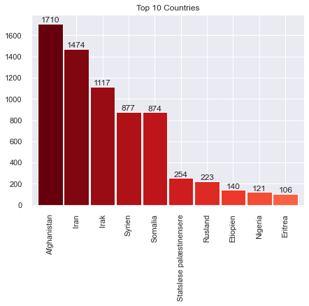

### Decision extraction:

Similarly to Unknown Homeland we applied regular expressions in order to extract the outcomes of the Danish Refugee Appeals Board decision.
    

    
The following table gives an idea of decision outcome rate by country:

<table border="1" class="dataframe">
  <thead>
    <tr style="text-align: right;">
      <th>Country of origin</th>
      <th>Decision Outcome</th>
      <th>Frequency</th>
    </tr>
  </thead>
  <tbody>
    <tr>
      <th rowspan="2" valign="top">Afghanistan</th>
      <th>affirmed</th>
      <td>1271</td>
    </tr>
    <tr>
      <th>overturned</th>
      <td>439</td>
    </tr>
    <tr>
      <th>Albanien</th>
      <th>affirmed</th>
      <td>14</td>
    </tr>
    <tr>
      <th>...</th>
      <th>...</th>
      <td>...</td>
    </tr>
    <tr>
      <th rowspan="2" valign="top">Zambia</th>
      <th>affirmed</th>
      <td>3</td>
    </tr>
    <tr>
      <th>overturned</th>
      <td>2</td>
    </tr>
    <tr>
      <th rowspan="2" valign="top">Zimbabwe</th>
      <th>overturned</th>
      <td>4</td>
    </tr>
    <tr>
      <th>affirmed</th>
      <td>3</td>
    </tr>
    <tr>
      <th>Østrig</th>
      <th>affirmed</th>
      <td>10</td>
    </tr>
  </tbody>
</table>

The next plot shows top 15 countries with their respective decision outcome rates.

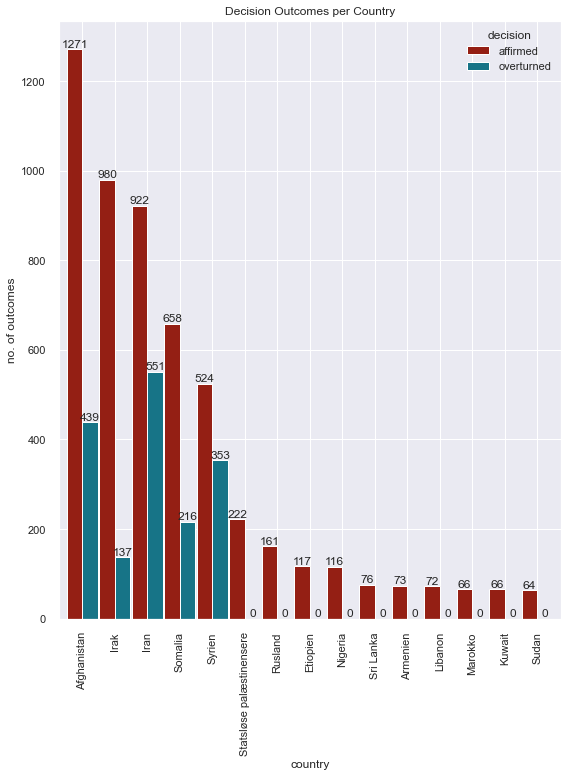

### Gender of applicants extraction:

The content of the texts revealed another category the one of `couples`. Although not applicable for a **gender** category we decided to add it here for brevity.
Once more our regular expressions missed some results, but in all very little.   

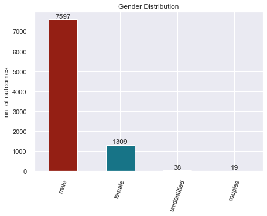
    

### Year of decision and outcome rate:
    
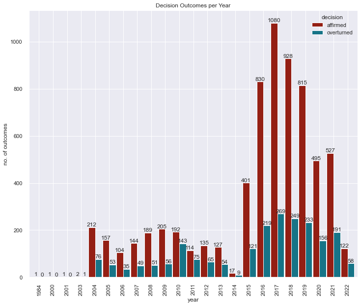
    
We deemed it meight be useful to plot decision outcome frequencies by gender for each year:
    
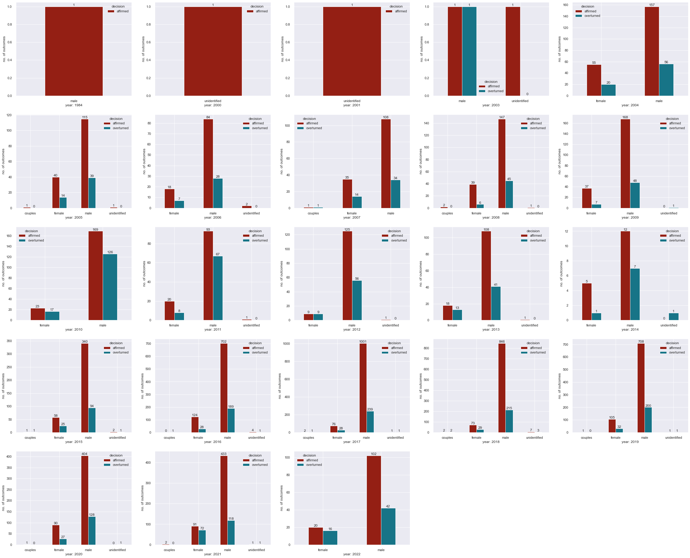
  

### Asylum motives distribution:

We wanted to compare the distributions of Asylum Motives and see if and how they differ from those in the Unknown Homeland cases.

    Agents of Persecution                                         2383
    Politiske forhold                                             2365
    Privatretlig forhold                                          1853
    Generelle forhold                                             1838
    Religiøse forhold                                             1355
                                                                  ... 
    Artikel 3                                                        2
    Pas-sager                                                        1
    TagCollectionMotive                                              1
    Artikel 9 (familiemedlemmer med international beskyttelse)       1
    Artikel 8 (uledsagede mindreårige)                               1

The next figure shows top ten most frequent asylum motives for all countries.

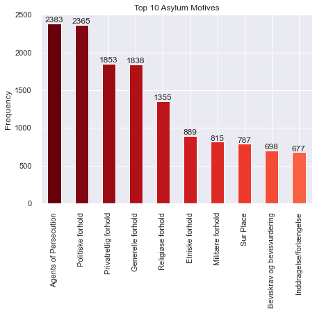
    

## Keyword in context exploration:

As our main focus revolved around Bidoons we wanted to see how many times the term **Bidoon** appeared in this dataset. We found that the term appeared 88 times a rather small number.

We applied KWIC in order to get some context around the text. Below we can see 10 random samples out of 467 contexts for 'bidoon'.

    
    ner i Kuwait, der er årsag til hans udrejse. Det fremgår af baggrundsoplysninger om situationen for  bidoon er i Kuwait, at etniske bidoonere udsættes for diskrimination, og at de har begrænsede rettigheder. 
    n) fra Kuwait. Indrejst i 2015.Flygtningenævnet udtalte: ”Ansøgeren har oplyst, at han er statsløs ( bidoon ) og shia muslim fra […], Kuwait. Ansøgeren har ikke været medlem af politiske eller religiøse foren
     Flygtningenævnet udtalte: ”Ansøgeren er etnisk araber og shia-muslim. Ansøgeren har oplyst at være  bidoon  (statsløs) fra [A], Kuwait. Ansøgeren har ikke været medlem af politiske eller religiøse foreninger
    e: ”Den mandlige ansøger er etnisk araber og shiamuslim. Den mandlige ansøger har oplyst, at han er  bidoon  (statsløs) fra […], Al-Ahmadi, Kuwait. Den mandlige ansøger har deltaget i én demonstration til for
    ns han ved indrejse i Danmark har oplyst navnet [D], født [i efteråret] 1993, og at han er statsløs  bidoon  fra Kuwait. Hertil kommer, at de af ansøgeren fremlagte dokumenter, der angiveligt vedrører hans fa
    gernes forklaringer om, at de hos de græske myndigheder tre gange forsøgte at blive registreret som  bidoon er, forklarer ikke, hvorfor ansøgerne oplyste et andet navn eller en anden fødselsdato, ligesom ansø
    nsøgeren underskrev et dokument, som forpligtede ansøgeren til at videregive oplysninger om, hvilke  bidoon ere, som havde deltaget i demonstrationer. Lederen af politistationen orienterede ansøgeren om, at d
    tte herfor oplyst, at han deltog i en demonstration [i sommeren] 2014, i byen Taima for statsløses ( bidoon eres) rettigheder. Omkring 30 minutter efter demonstrationens start greb myndighederne ind, hvorefte
    uwait. Indrejst i 2015. Flygtningenævnet udtalte: ”Ansøgeren er etnisk araber, angiveligt statsløs ( bidoon ) og shia-muslim fra Slaybia, Kuwait. Ansøgeren har ikke været medlem af politiske eller religiøse f
    015. Flygtningenævnet udtalte: ”Ansøgerne er etnisk araber, shiamuslim af trosretning og angiveligt  bidoon ere (statsløs) fra Taima i al-Jahra, Kuwait. Ansøgerne har ikke været medlem af politiske eller reli

The decision outcomes rate for bidooners outside Unknown Homeland cases remained more or less the same.

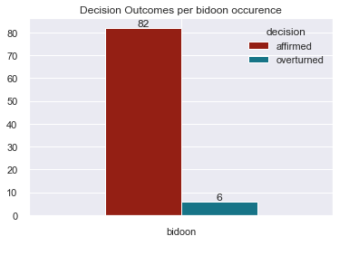
    
## Frequency analysis:

We again looked for the most frequent tokens found in the **whole** corpus. The table below presents top ten of them.

<table border="1" class="dataframe">
  <thead>
    <tr style="text-align: right;">
      <th>Token</th>
      <th>Frequency</th>
    </tr>
  </thead>
  <tbody>
    <tr>
      <th>ansøger</th>
      <td>134357</td>
    </tr>
    <tr>
      <th>klager</th>
      <td>36862</td>
    </tr>
    <tr>
      <th>lægge</th>
      <td>27478</td>
    </tr>
    <tr>
      <th>stk</th>
      <td>25983</td>
    </tr>
    <tr>
      <th>finde</th>
      <td>25739</td>
    </tr>
    <tr>
      <th>forklare</th>
      <td>25148</td>
    </tr>
    <tr>
      <th>grund</th>
      <td>21476</td>
    </tr>
    <tr>
      <th>udlændingelov</th>
      <td>21365</td>
    </tr>
    <tr>
      <th>forklaring</th>
      <td>20625</td>
    </tr>
    <tr>
      <th>asylmotiv</th>
      <td>18889</td>
    </tr>
  </tbody>
</table>

This is a visualization of the above table.

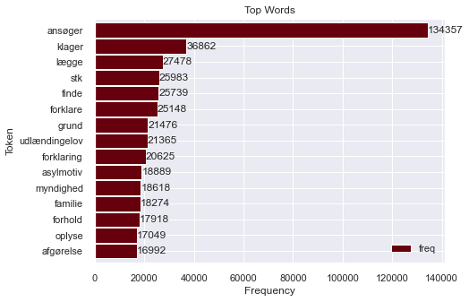
    

## N-gram analysis:

Below we see the ten most common bigrams of our corpus.

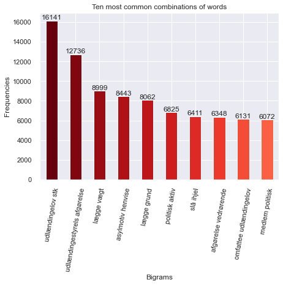
    

## TF-IDF

The shape of the resulting vector of the vocabulary created from our given corpus consists of 8963 texts with 50262 terms (or dimensions).

Below we can see 10 random terms from the produced vocabulary:

    ['omgjorde',
     '2022',
     'udlændingestyrels',
     'afgørelse',
     'sag',
     'statusændring',
     'vedrørende',
     'kvindelig',
     'statsborger',
     'syrien']

The following table provides a peek at the documents and their respective terms with their TF-IDF scores.

<table border="1" class="dataframe">
  <thead>
    <tr style="text-align: right;">
      <th></th>
      <th>doc</th>
      <th>keywords</th>
    </tr>
  </thead>
  <tbody>
    <tr>
      <th>0</th>
      <td>omgjorde 2022 udlændingestyrels afgørelse sag ...</td>
      <td>{'klager': 0.443, 'exmand': 0.255, 'syrien': 0...</td>
    </tr>
    <tr>
      <th>1</th>
      <td>hjemvise 2021 udlændingestyrels afgørelse sag ...</td>
      <td>{'storesøster': 0.493, 'klager': 0.469, 'ansøg...</td>
    </tr>
    <tr>
      <th>2</th>
      <td>omgjorde 2022 udlændingestyrels afgørelse sag ...</td>
      <td>{'eritrea': 0.428, 'klager': 0.364, 'føde': 0....</td>
    </tr>
    <tr>
      <th>3</th>
      <td>stadfæste 2022 udlændingestyrels afgørelse ved...</td>
      <td>{'afghanistan': 0.334, 'the': 0.311, 'of': 0.2...</td>
    </tr>
    <tr>
      <th>4</th>
      <td>stadfæste 2022 udlændingestyrels afgørelse ved...</td>
      <td>{'afghanistan': 0.309, 'the': 0.276, '2021': 0...</td>
    </tr>
    <tr>
      <th>...</th>
      <td>...</td>
      <td>...</td>
    </tr>
    <tr>
      <th>8958</th>
      <td>meddele 2004 opholdstilladelse kstatus mandlig...</td>
      <td>{'dostum': 0.322, 'rang': 0.305, 'khad': 0.291...</td>
    </tr>
    <tr>
      <th>8959</th>
      <td>meddele 2004 opholdstilladelse fstatus ægtepar...</td>
      <td>{'afghanistan': 0.473, 'taleban': 0.201, 'magt...</td>
    </tr>
    <tr>
      <th>8960</th>
      <td>stadfæste 2004 udlændingestyrels afgørelse ved...</td>
      <td>{'hezbewahdat': 0.392, 'kommandant': 0.267, 'a...</td>
    </tr>
    <tr>
      <th>8961</th>
      <td>stadfæste 2004 udlændingestyrels afgørelse ved...</td>
      <td>{'hezbewahdat': 0.456, 'krigstjeneste': 0.287,...</td>
    </tr>
    <tr>
      <th>8962</th>
      <td>stadfæste 2004 udlændingestyrels afgørelse ved...</td>
      <td>{'khad': 0.593, 'ansøger': 0.273, 'pdpa': 0.14...</td>
    </tr>
  </tbody>
</table>

Finally we can see the top 20 most common words based on their TF-IDF scores.

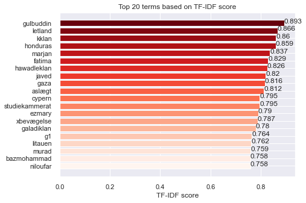