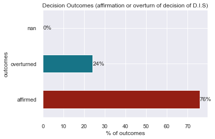

# ALL cases EDA:

# Import data set:

    (9635, 5)

# Dataset preprocessing:

Keep ALL cases except for Unknown Homeland (Ukendt hjemland):

    (9443, 4)

<table border="1" class="dataframe">
  <thead>
    <tr style="text-align: right;">
      <th></th>
      <th>id</th>
      <th>asylum_motive</th>
      <th>country</th>
      <th>text</th>
    </tr>
  </thead>
  <tbody>
    <tr>
      <th>0</th>
      <td>0</td>
      <td>[Statusændring,  Privatretlig forhold,  Øvrige...</td>
      <td>Syrien</td>
      <td>Nævnet omgjorde i maj 2022 Udlændinges...</td>
    </tr>
    <tr>
      <th>1</th>
      <td>1</td>
      <td>[To-instansbehandling,  Bortfald]</td>
      <td>Syrien</td>
      <td>Nævnet hjemviste i november 2021 Udlæn...</td>
    </tr>
    <tr>
      <th>2</th>
      <td>2</td>
      <td>[Statusændring,  Militære forhold]</td>
      <td>Eritrea</td>
      <td>Nævnet omgjorde i maj 2022 Udlændinges...</td>
    </tr>
    <tr>
      <th>3</th>
      <td>3</td>
      <td>[Generelle forhold,  Privatretlig forhold]</td>
      <td>Afghanistan</td>
      <td>Nævnet stadfæstede i maj 2022 Udlændin...</td>
    </tr>
    <tr>
      <th>4</th>
      <td>4</td>
      <td>[Kriminelle forhold,  Privatretlig forhold,  S...</td>
      <td>Afghanistan</td>
      <td>Nævnet stadfæstede i maj 2022 Udlændin...</td>
    </tr>
  </tbody>
</table>

Check for potential duplicates and drop them:

<table border="1" class="dataframe">
  <thead>
    <tr style="text-align: right;">
      <th></th>
      <th>id</th>
      <th>asylum_motive</th>
      <th>country</th>
      <th>text</th>
    </tr>
  </thead>
  <tbody>
    <tr>
      <th>131</th>
      <td>131</td>
      <td>[Generelle forhold,  Øvrige modsætningsforhold...</td>
      <td>Syrien</td>
      <td>Nævnet omgjorde i november 2021 Udlænd...</td>
    </tr>
    <tr>
      <th>132</th>
      <td>132</td>
      <td>[Generelle forhold,  Øvrige modsætningsforhold...</td>
      <td>Syrien</td>
      <td>Nævnet omgjorde i november 2021 Udlænd...</td>
    </tr>
    <tr>
      <th>521</th>
      <td>521</td>
      <td>[Udsendelse (§ 49 a m.v.),  Sur Place,  Privat...</td>
      <td>Afghanistan</td>
      <td>Nævnet stadfæstede i juli 2021 Udlændi...</td>
    </tr>
    <tr>
      <th>1098</th>
      <td>1098</td>
      <td>[Konsekvensstatus,  Statusændring,  Politiske ...</td>
      <td>Syrien</td>
      <td>Nævnet meddelte i oktober 2020 opholds...</td>
    </tr>
    <tr>
      <th>1142</th>
      <td>1142</td>
      <td>[Seksuelle forhold,  Overgreb,  Etniske forhol...</td>
      <td>Den Demokratiske Republik Congo (DR Congo)</td>
      <td>Nævnet stadfæstede i september 2020 Ud...</td>
    </tr>
    <tr>
      <th>...</th>
      <td>...</td>
      <td>...</td>
      <td>...</td>
      <td>...</td>
    </tr>
    <tr>
      <th>9388</th>
      <td>9388</td>
      <td>[Politiske forhold,  Agents of Persecution,  T...</td>
      <td>Afghanistan</td>
      <td>Nævnet meddelte i juli 2010 opholdstilladelse ...</td>
    </tr>
    <tr>
      <th>9582</th>
      <td>9582</td>
      <td>[Politiske forhold]</td>
      <td>Afghanistan</td>
      <td>Nævnet stadfæstede i juni 2005 Udlændi...</td>
    </tr>
    <tr>
      <th>9594</th>
      <td>9594</td>
      <td>[Privatretlig forhold]</td>
      <td>Afghanistan</td>
      <td>Nævnet stadfæstede i december 2005 Udl...</td>
    </tr>
    <tr>
      <th>9602</th>
      <td>9602</td>
      <td>[Politiske forhold]</td>
      <td>Afghanistan</td>
      <td>Nævnet stadfæstede i april 2004 en afg...</td>
    </tr>
    <tr>
      <th>9607</th>
      <td>9607</td>
      <td>[Konsekvensstatus,  Politiske forhold,  Tortur]</td>
      <td>Afghanistan</td>
      <td>Nævnet meddelte i august 2004 opholdst...</td>
    </tr>
  </tbody>
</table>

480 rows × 4 columns

See shape of new data frame:

    (8963, 4)

## Length of texts

Create a numeric column in order to get a feel about the length of the texts. 

<table border="1" class="dataframe">
  <thead>
    <tr style="text-align: right;">
      <th></th>
      <th>count</th>
      <th>mean</th>
      <th>std</th>
      <th>min</th>
      <th>25%</th>
      <th>50%</th>
      <th>75%</th>
      <th>max</th>
    </tr>
  </thead>
  <tbody>
    <tr>
      <th>id</th>
      <td>8963.0</td>
      <td>4825.259846</td>
      <td>2830.033440</td>
      <td>0.0</td>
      <td>2307.5</td>
      <td>4858.0</td>
      <td>7343.5</td>
      <td>9634.0</td>
    </tr>
    <tr>
      <th>length</th>
      <td>8963.0</td>
      <td>4159.678456</td>
      <td>2212.306528</td>
      <td>407.0</td>
      <td>2636.0</td>
      <td>3771.0</td>
      <td>5153.5</td>
      <td>24044.0</td>
    </tr>
  </tbody>
</table>

## Boxplot:

    <AxesSubplot:>

    

    

# Text Processing:

Column `text` is processed in order to extract data concerning:
- decision outcome
- gender of applicants
- year of decision

Steps included in the pipeline:
- lower casing
- punctuation removal
- stopword removal
- single letter word removal
- tokenization
- lemmatization

See ten first entries

<table border="1" class="dataframe">
  <thead>
    <tr style="text-align: right;">
      <th></th>
      <th>id</th>
      <th>asylum_motive</th>
      <th>country</th>
      <th>text</th>
      <th>length</th>
      <th>tokens</th>
      <th>num_tokens</th>
    </tr>
  </thead>
  <tbody>
    <tr>
      <th>0</th>
      <td>0</td>
      <td>[Statusændring,  Privatretlig forhold,  Øvrige...</td>
      <td>Syrien</td>
      <td>Nævnet omgjorde i maj 2022 Udlændinges...</td>
      <td>7751</td>
      <td>[omgjorde, 2022, udlændingestyrels, afgørelse,...</td>
      <td>600</td>
    </tr>
    <tr>
      <th>1</th>
      <td>1</td>
      <td>[To-instansbehandling,  Bortfald]</td>
      <td>Syrien</td>
      <td>Nævnet hjemviste i november 2021 Udlæn...</td>
      <td>2009</td>
      <td>[hjemvise, 2021, udlændingestyrels, afgørelse,...</td>
      <td>147</td>
    </tr>
    <tr>
      <th>2</th>
      <td>2</td>
      <td>[Statusændring,  Militære forhold]</td>
      <td>Eritrea</td>
      <td>Nævnet omgjorde i maj 2022 Udlændinges...</td>
      <td>2670</td>
      <td>[omgjorde, 2022, udlændingestyrels, afgørelse,...</td>
      <td>196</td>
    </tr>
    <tr>
      <th>3</th>
      <td>3</td>
      <td>[Generelle forhold,  Privatretlig forhold]</td>
      <td>Afghanistan</td>
      <td>Nævnet stadfæstede i maj 2022 Udlændin...</td>
      <td>6695</td>
      <td>[stadfæste, 2022, udlændingestyrels, afgørelse...</td>
      <td>573</td>
    </tr>
    <tr>
      <th>4</th>
      <td>4</td>
      <td>[Kriminelle forhold,  Privatretlig forhold,  S...</td>
      <td>Afghanistan</td>
      <td>Nævnet stadfæstede i maj 2022 Udlændin...</td>
      <td>11359</td>
      <td>[stadfæste, 2022, udlændingestyrels, afgørelse...</td>
      <td>899</td>
    </tr>
    <tr>
      <th>5</th>
      <td>5</td>
      <td>[Politiske forhold,  Privatretlig forhold]</td>
      <td>Rwanda</td>
      <td>Nævnet stadfæstede i maj 2022 Udlændin...</td>
      <td>7232</td>
      <td>[stadfæste, 2022, udlændingestyrels, afgørelse...</td>
      <td>471</td>
    </tr>
    <tr>
      <th>6</th>
      <td>6</td>
      <td>[Inddragelse/forlængelse,  Privatretlig forhold]</td>
      <td>Afghanistan</td>
      <td>Nævnet omgjorde i maj 2022 Udlændinges...</td>
      <td>4902</td>
      <td>[omgjorde, 2022, udlændingestyrels, afgørelse,...</td>
      <td>355</td>
    </tr>
    <tr>
      <th>7</th>
      <td>7</td>
      <td>[Øvrige modsætningsforhold til myndighederne, ...</td>
      <td>Syrien</td>
      <td>Nævnet omgjorde i maj 2022 Udlændinges...</td>
      <td>6470</td>
      <td>[omgjorde, 2022, udlændingestyrels, afgørelse,...</td>
      <td>442</td>
    </tr>
    <tr>
      <th>8</th>
      <td>8</td>
      <td>[Udsendelse (§ 49 a m.v.),  Militære forhold, ...</td>
      <td>Iran</td>
      <td>Nævnet stadfæstede i maj 2022 Udlændin...</td>
      <td>4017</td>
      <td>[stadfæste, 2022, udlændingestyrels, afgørelse...</td>
      <td>302</td>
    </tr>
    <tr>
      <th>9</th>
      <td>9</td>
      <td>[Dublin,  Artikel 18 (Den ansvarlige medlemsst...</td>
      <td>Tyskland</td>
      <td>Nævnet stadfæstede i april 2022 Udlænd...</td>
      <td>3971</td>
      <td>[stadfæste, 2022, udlændingestyrels, afgørelse...</td>
      <td>288</td>
    </tr>
  </tbody>
</table>

# Country of Origin:

<table border="1" class="dataframe">
  <thead>
    <tr style="text-align: right;">
      <th></th>
      <th>count</th>
    </tr>
  </thead>
  <tbody>
    <tr>
      <th>Afghanistan</th>
      <td>1710</td>
    </tr>
    <tr>
      <th>Iran</th>
      <td>1474</td>
    </tr>
    <tr>
      <th>Irak</th>
      <td>1117</td>
    </tr>
    <tr>
      <th>Syrien</th>
      <td>877</td>
    </tr>
    <tr>
      <th>Somalia</th>
      <td>874</td>
    </tr>
    <tr>
      <th>...</th>
      <td>...</td>
    </tr>
    <tr>
      <th>Honduras</th>
      <td>1</td>
    </tr>
    <tr>
      <th>Nordkorea</th>
      <td>1</td>
    </tr>
    <tr>
      <th>Island</th>
      <td>1</td>
    </tr>
    <tr>
      <th>Cypern</th>
      <td>1</td>
    </tr>
    <tr>
      <th>Burkina Faso</th>
      <td>1</td>
    </tr>
  </tbody>
</table>

121 rows × 1 columns

Plot top ten countries:

    

    

# Decision extraction:

Plot decision:

    Text(0, 0.5, 'outcomes')

    

    

Plot decision outcome rate by country:

<table border="1" class="dataframe">
  <thead>
    <tr style="text-align: right;">
      <th></th>
      <th></th>
      <th>count</th>
    </tr>
    <tr>
      <th>country</th>
      <th>decision</th>
      <th></th>
    </tr>
  </thead>
  <tbody>
    <tr>
      <th rowspan="2" valign="top"></th>
      <th>affirmed</th>
      <td>39</td>
    </tr>
    <tr>
      <th>overturned</th>
      <td>11</td>
    </tr>
    <tr>
      <th rowspan="2" valign="top">Afghanistan</th>
      <th>affirmed</th>
      <td>1271</td>
    </tr>
    <tr>
      <th>overturned</th>
      <td>439</td>
    </tr>
    <tr>
      <th>Albanien</th>
      <th>affirmed</th>
      <td>14</td>
    </tr>
    <tr>
      <th>...</th>
      <th>...</th>
      <td>...</td>
    </tr>
    <tr>
      <th rowspan="2" valign="top">Zambia</th>
      <th>affirmed</th>
      <td>3</td>
    </tr>
    <tr>
      <th>overturned</th>
      <td>2</td>
    </tr>
    <tr>
      <th rowspan="2" valign="top">Zimbabwe</th>
      <th>overturned</th>
      <td>4</td>
    </tr>
    <tr>
      <th>affirmed</th>
      <td>3</td>
    </tr>
    <tr>
      <th>Østrig</th>
      <th>affirmed</th>
      <td>10</td>
    </tr>
  </tbody>
</table>

187 rows × 1 columns

    

    

# Gender of applicants extraction:

    Text(0, 0.5, 'nn. of outcomes')

    

    

# Year of decision:

    

    

Plot Decision Outcome Frequencies by Gender for each Year:

    

    

# Asylum motives distribution:

    Agents of Persecution                                         2383
    Politiske forhold                                             2365
    Privatretlig forhold                                          1853
    Generelle forhold                                             1838
    Religiøse forhold                                             1355
                                                                  ... 
    Artikel 3                                                        2
    Pas-sager                                                        1
    TagCollectionMotive                                              1
    Artikel 9 (familiemedlemmer med international beskyttelse)       1
    Artikel 8 (uledsagede mindreårige)                               1
    Name: asylum_motive, Length: 65, dtype: int64

Plot ten most frequent asylum motives:

    Text(0, 0.5, 'Frequency')

    

    

# Search for specific terms:

- Bidoon:

<table border="1" class="dataframe">
  <thead>
    <tr style="text-align: right;">
      <th></th>
      <th>counts</th>
    </tr>
  </thead>
  <tbody>
    <tr>
      <th>bidoon</th>
      <td>86</td>
    </tr>
    <tr>
      <th>Bidoon</th>
      <td>2</td>
    </tr>
  </tbody>
</table>

Merge categories and count again:

<table border="1" class="dataframe">
  <thead>
    <tr style="text-align: right;">
      <th></th>
      <th>counts</th>
    </tr>
  </thead>
  <tbody>
    <tr>
      <th>bidoon</th>
      <td>88</td>
    </tr>
  </tbody>
</table>

See some context:

    10 random samples out of 467 contexts for 'bidoon':
    ner i Kuwait, der er årsag til hans udrejse. Det fremgår af baggrundsoplysninger om situationen for  bidoon er i Kuwait, at etniske bidoonere udsættes for diskrimination, og at de har begrænsede rettigheder. 
    n) fra Kuwait. Indrejst i 2015.Flygtningenævnet udtalte: ”Ansøgeren har oplyst, at han er statsløs ( bidoon ) og shia muslim fra […], Kuwait. Ansøgeren har ikke været medlem af politiske eller religiøse foren
     Flygtningenævnet udtalte: ”Ansøgeren er etnisk araber og shia-muslim. Ansøgeren har oplyst at være  bidoon  (statsløs) fra [A], Kuwait. Ansøgeren har ikke været medlem af politiske eller religiøse foreninger
    e: ”Den mandlige ansøger er etnisk araber og shiamuslim. Den mandlige ansøger har oplyst, at han er  bidoon  (statsløs) fra […], Al-Ahmadi, Kuwait. Den mandlige ansøger har deltaget i én demonstration til for
    ns han ved indrejse i Danmark har oplyst navnet [D], født [i efteråret] 1993, og at han er statsløs  bidoon  fra Kuwait. Hertil kommer, at de af ansøgeren fremlagte dokumenter, der angiveligt vedrører hans fa
    gernes forklaringer om, at de hos de græske myndigheder tre gange forsøgte at blive registreret som  bidoon er, forklarer ikke, hvorfor ansøgerne oplyste et andet navn eller en anden fødselsdato, ligesom ansø
    nsøgeren underskrev et dokument, som forpligtede ansøgeren til at videregive oplysninger om, hvilke  bidoon ere, som havde deltaget i demonstrationer. Lederen af politistationen orienterede ansøgeren om, at d
    tte herfor oplyst, at han deltog i en demonstration [i sommeren] 2014, i byen Taima for statsløses ( bidoon eres) rettigheder. Omkring 30 minutter efter demonstrationens start greb myndighederne ind, hvorefte
    uwait. Indrejst i 2015. Flygtningenævnet udtalte: ”Ansøgeren er etnisk araber, angiveligt statsløs ( bidoon ) og shia-muslim fra Slaybia, Kuwait. Ansøgeren har ikke været medlem af politiske eller religiøse f
    015. Flygtningenævnet udtalte: ”Ansøgerne er etnisk araber, shiamuslim af trosretning og angiveligt  bidoon ere (statsløs) fra Taima i al-Jahra, Kuwait. Ansøgerne har ikke været medlem af politiske eller reli

Decision outcomes for bidooners outside Unknown Homeland.

    

    

# Natural Language Processing:

## Frequency analysis:

Here the most frequent tokens in the **whole** corpus are counted.

The table below presents top ten words.

<table border="1" class="dataframe">
  <thead>
    <tr style="text-align: right;">
      <th></th>
      <th>freq</th>
    </tr>
    <tr>
      <th>token</th>
      <th></th>
    </tr>
  </thead>
  <tbody>
    <tr>
      <th>ansøger</th>
      <td>134357</td>
    </tr>
    <tr>
      <th>klager</th>
      <td>36862</td>
    </tr>
    <tr>
      <th>lægge</th>
      <td>27478</td>
    </tr>
    <tr>
      <th>stk</th>
      <td>25983</td>
    </tr>
    <tr>
      <th>finde</th>
      <td>25739</td>
    </tr>
    <tr>
      <th>forklare</th>
      <td>25148</td>
    </tr>
    <tr>
      <th>grund</th>
      <td>21476</td>
    </tr>
    <tr>
      <th>udlændingelov</th>
      <td>21365</td>
    </tr>
    <tr>
      <th>forklaring</th>
      <td>20625</td>
    </tr>
    <tr>
      <th>asylmotiv</th>
      <td>18889</td>
    </tr>
  </tbody>
</table>

    

    

## N-gram analysis:

    Text(0, 0.5, 'Frequencies')

    

    

## TF-IDF

Below is the shape of the resulting vector of the vocabulary created from the given context.

    (8963, 50262)

Ten random words from the vocabulary:

    ['omgjorde',
     '2022',
     'udlændingestyrels',
     'afgørelse',
     'sag',
     'statusændring',
     'vedrørende',
     'kvindelig',
     'statsborger',
     'syrien']

Peek at the IDF values array:

    array([9.40782465, 9.40782465, 8.71467747, ..., 9.40782465, 9.40782465,
           8.71467747])

<table border="1" class="dataframe">
  <thead>
    <tr style="text-align: right;">
      <th></th>
      <th>doc</th>
      <th>keywords</th>
    </tr>
  </thead>
  <tbody>
    <tr>
      <th>0</th>
      <td>omgjorde 2022 udlændingestyrels afgørelse sag ...</td>
      <td>{'klager': 0.443, 'exmand': 0.255, 'syrien': 0...</td>
    </tr>
    <tr>
      <th>1</th>
      <td>hjemvise 2021 udlændingestyrels afgørelse sag ...</td>
      <td>{'storesøster': 0.493, 'klager': 0.469, 'ansøg...</td>
    </tr>
    <tr>
      <th>2</th>
      <td>omgjorde 2022 udlændingestyrels afgørelse sag ...</td>
      <td>{'eritrea': 0.428, 'klager': 0.364, 'føde': 0....</td>
    </tr>
    <tr>
      <th>3</th>
      <td>stadfæste 2022 udlændingestyrels afgørelse ved...</td>
      <td>{'afghanistan': 0.334, 'the': 0.311, 'of': 0.2...</td>
    </tr>
    <tr>
      <th>4</th>
      <td>stadfæste 2022 udlændingestyrels afgørelse ved...</td>
      <td>{'afghanistan': 0.309, 'the': 0.276, '2021': 0...</td>
    </tr>
    <tr>
      <th>...</th>
      <td>...</td>
      <td>...</td>
    </tr>
    <tr>
      <th>8958</th>
      <td>meddele 2004 opholdstilladelse kstatus mandlig...</td>
      <td>{'dostum': 0.322, 'rang': 0.305, 'khad': 0.291...</td>
    </tr>
    <tr>
      <th>8959</th>
      <td>meddele 2004 opholdstilladelse fstatus ægtepar...</td>
      <td>{'afghanistan': 0.473, 'taleban': 0.201, 'magt...</td>
    </tr>
    <tr>
      <th>8960</th>
      <td>stadfæste 2004 udlændingestyrels afgørelse ved...</td>
      <td>{'hezbewahdat': 0.392, 'kommandant': 0.267, 'a...</td>
    </tr>
    <tr>
      <th>8961</th>
      <td>stadfæste 2004 udlændingestyrels afgørelse ved...</td>
      <td>{'hezbewahdat': 0.456, 'krigstjeneste': 0.287,...</td>
    </tr>
    <tr>
      <th>8962</th>
      <td>stadfæste 2004 udlændingestyrels afgørelse ved...</td>
      <td>{'khad': 0.593, 'ansøger': 0.273, 'pdpa': 0.14...</td>
    </tr>
  </tbody>
</table>

8963 rows × 2 columns

Twenty most common words based on TF-IDF values

    [   ('gulbuddin', 0.893),
        ('letland', 0.866),
        ('kklan', 0.86),
        ('honduras', 0.859),
        ('marjan', 0.837),
        ('fatima', 0.829),
        ('hawadleklan', 0.826),
        ('javed', 0.82),
        ('gaza', 0.816),
        ('aslægt', 0.812),
        ('studiekammerat', 0.795),
        ('cypern', 0.795),
        ('ezmary', 0.79),
        ('xbevægelse', 0.787),
        ('galadiklan', 0.78),
        ('g1', 0.764),
        ('litauen', 0.762),
        ('murad', 0.759),
        ('niloufar', 0.758),
        ('bazmohammad', 0.758)]

Plotting the pairs:

    

    

