# ALL cases topic modelling: 

Again, the same methodology and techniques were implemented in order to see latent topics in the corpus of summary cases regarding the rest of our dataset excluding those cases that were categorized as Unknown Homeland. So, after processing the dataset (dropping duplicate entries, etc.) we were left with **8963** case summaries.

## Topic Modelling:

### Latent Dirichlet Allocation (LDA):

    The coherence score for LDA (0.73) was highest with 3 topics.

Building the model with the `optimal number of topics` produced the following results:

    
    Topic 01
     forklare (1.81)
     familie (1.15)
     myndighed (0.96)
     iran (0.90)
     udrejse (0.86)
    
    Topic 02
     klager (2.65)
     syrien (1.64)
     opholdstilladelse (1.55)
     myndighed (1.43)
     meddele (1.00)
    
    Topic 03
     klager (6.72)
     somalia (1.90)
     opholdstilladelse (1.74)
     alshabaab (1.33)
     danmark (1.28)

Let's visualise the topics produced by LDA:

[LDA_ALL.html](../../_media/LDA_ALL.html ':include :type=iframe width=100% height=800px')

### Non-Negative Matrix Factorization:

    The coherence score for NMF (0.74) was highest with 6 topics.

After building the model with the `optimal number of topics` we got:

    
    Topic 01
     klager (13.94)
     klagere (1.86)
     opholdstilladelse (1.75)
     danmark (1.04)
     syrien (0.97)
    
    Topic 02
     iran (2.43)
     iransk (1.12)
     myndighed (0.78)
     forklare (0.68)
     aktivitet (0.68)
    
    Topic 03
     afghanistan (2.62)
     taliban (2.31)
     forklare (0.71)
     familie (0.66)
     slå (0.51)
    
    Topic 04
     somalia (4.46)
     alshabaab (3.11)
     mogadishu (0.90)
     mor (0.75)
     omskæring (0.63)
    
    Topic 05
     irak (3.94)
     familie (0.74)
     bagdad (0.59)
     forklare (0.50)
     irakisk (0.50)
    
    Topic 06
     syrien (1.66)
     libanon (1.28)
     syrisk (0.91)
     myndighed (0.68)
     palæstinenser (0.51)

We can now visualise the topics produced by NMF:

[NMF_ALL.html](../../_media/NMF_ALL.html ':include :type=iframe width=100% height=800px')

### Latent Semantic Analysis/Indexing:

    The coherence score for SVD (0.72) was highest with 5 topics.

Building the model with the `optimal number of topics` provide us with the following results:

    
    Topic 01
     klager (2.60)
     opholdstilladelse (0.55)
     somalia (0.53)
     syrien (0.51)
     forklare (0.46)
    
    Topic 02
     afghanistan (1.06)
     iran (1.02)
     taliban (0.82)
     forklare (0.81)
     irak (0.70)
    
    Topic 03
     taliban (-18.68)
     afghanistan (-18.35)
     somalia (-6.69)
     alshabaab (-5.07)
     kabul (-3.63)
    
    Topic 04
     somalia (23.70)
     alshabaab (16.51)
     irak (5.11)
     mogadishu (4.84)
     omskæring (3.50)
    
    Topic 05
     irak (11.68)
     libanon (3.78)
     syrien (3.38)
     bagdad (2.01)
     palæstinenser (1.74)

## WordClouds:

### WordClouds from the LDA model:
   
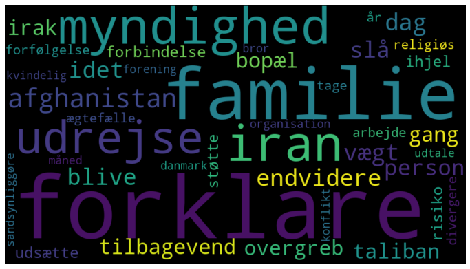
    
   
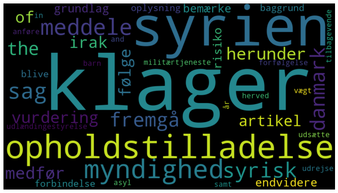
    
    
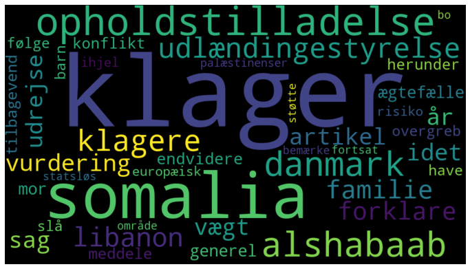
    

### WordClouds from the NMF model:

  
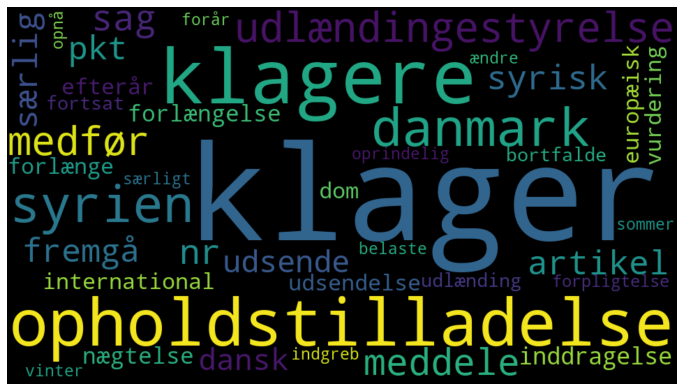
    
    
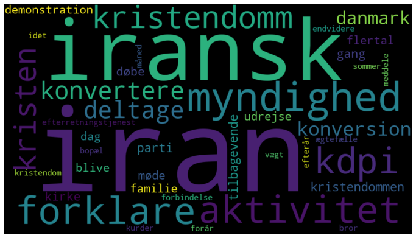
    
   
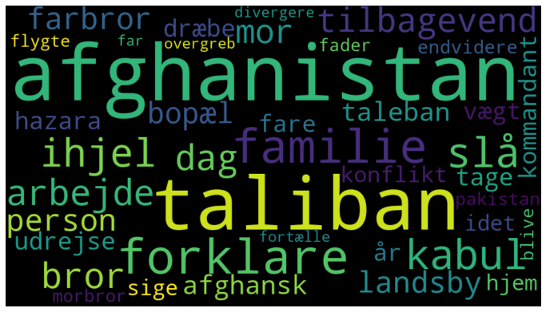
    
   
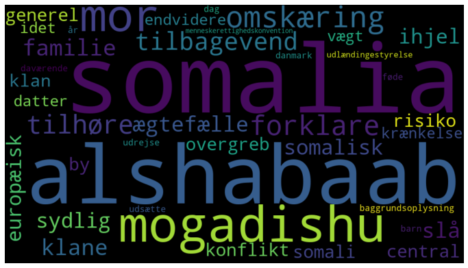
    
   
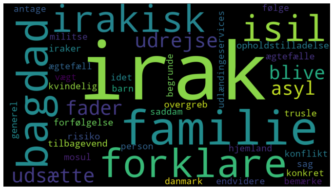
    
   
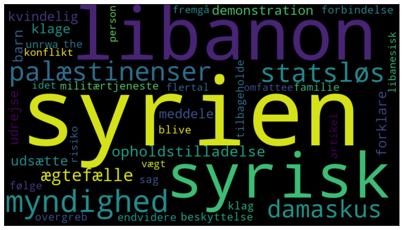
    
### WordsClouds from the SVD model:

   
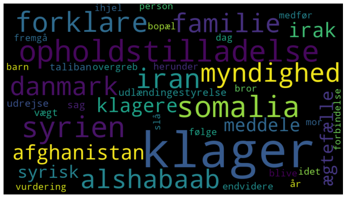
    
   
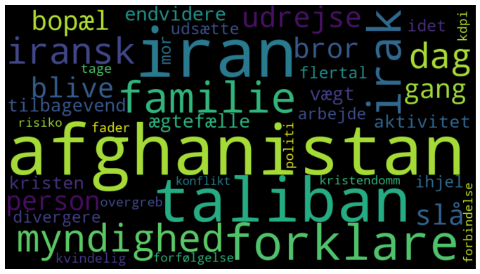
    
   
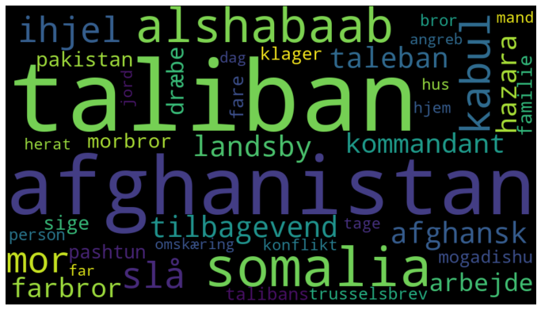
    
   
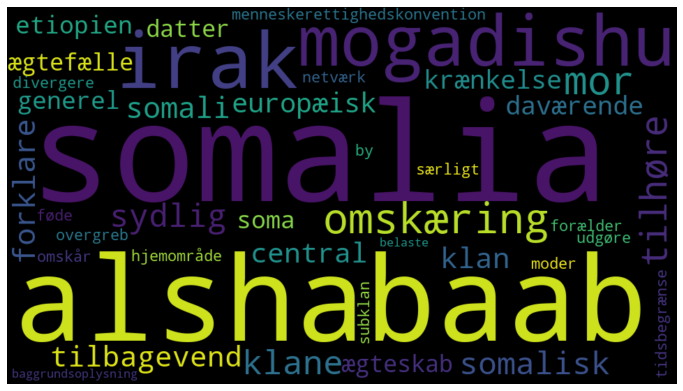
    
   
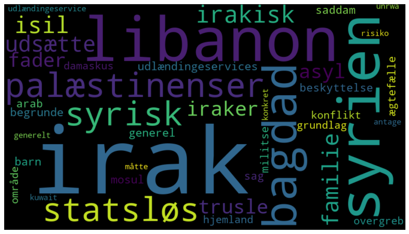