# Unknown Homeland cases EDA:

Firstly, we had to get all the case summaries that were uploaded to the open website of the Danish Refugee Appeals Board (Flygtningenævnet) found [here](https://fln.dk/da/Praksis). 
After importing the scraped case summaries we got 9635 files with 5 columns each. The columns that were of interest were those that included:

- Text of summaries.
- Countries of origin.
- Asylum motives.

## Dataset processing:

For the needs of this project and as former research had pointed out, cases that were denoted as **Unknown Homeland (Ukendt hjemland)** were kept.

After chosing this cases we were left with **192** cases. Below we can see the top five cases.

<table border="1" class="dataframe">
  <thead>
    <tr style="text-align: right;">
      <th>id</th>
      <th>asylum_motive</th>
      <th>country</th>
      <th>text</th>
    </tr>
  </thead>
  <tbody>
    <tr>
      <td>287</td>
      <td>[Etniske forhold]</td>
      <td>Ukendt hjemland</td>
      <td>Nævnet stadfæstede i november 2021 Udl...</td>
    </tr>
    <tr>
      <td>515</td>
      <td>[Kriminelle forhold,  Militære forhold]</td>
      <td>Ukendt hjemland</td>
      <td>Nævnet stadfæstede i juni 2021 Udlændi...</td>
    </tr>
    <tr>
      <td>551</td>
      <td>[Sur Place,  LGBT,  Politiske forhold,  Etnisk...</td>
      <td>Ukendt hjemland</td>
      <td>Nævnet stadfæstede i juni 2021 Udlændi...</td>
    </tr>
    <tr>
      <td>989</td>
      <td>[Agents of Persecution,  Anden kønsrelateret f...</td>
      <td>Ukendt hjemland</td>
      <td>Nævnet stadfæstede i december 2020 Udl...</td>
    </tr>
    <tr>
      <td>1379</td>
      <td>[Militære forhold,  Nationalitet]</td>
      <td>Ukendt hjemland</td>
      <td>Nævnet hjemviste i juni 2020 Udlænding...</td>
    </tr>
  </tbody>
</table>

As it happens with data that were collected out-in-the-wild checking for potential duplicates and dropping them is always a good idea.

In the following table we can see those cases in our dataset.

<table border="1" class="dataframe">
  <thead>
    <tr style="text-align: right;">
      <th>id</th>
      <th>asylum_motive</th>
      <th>country</th>
      <th>text</th>
    </tr>
  </thead>
  <tbody>
    <tr>
      <td>1421</td>
      <td>[Inddragelse/forlængelse,  Religiøse forhold, ...</td>
      <td>Ukendt hjemland</td>
      <td>Nævnet stadfæstede i maj 2020 Udlændin...</td>
    </tr>
    <tr>
      <td>1440</td>
      <td>[Inddragelse/forlængelse,  Religiøse forhold, ...</td>
      <td>Ukendt hjemland</td>
      <td>Nævnet stadfæstede i maj 2020 Udlændin...</td>
    </tr>
    <tr>
      <td>4102</td>
      <td>[Politiske forhold,  Generelle forhold]</td>
      <td>Ukendt hjemland</td>
      <td>Nævnet stadfæstede i januar 2018 Udlæn...</td>
    </tr>
    <tr>
      <td>4103</td>
      <td>[Privatretlig forhold,  Generelle forhold]</td>
      <td>Ukendt hjemland</td>
      <td>Nævnet stadfæstede i januar 2018 Udlæn...</td>
    </tr>
    <tr>
      <td>4157</td>
      <td>[Nationalitet,  Generelle forhold,  Udrejsefor...</td>
      <td>Ukendt hjemland</td>
      <td>Nævnet stadfæstede i januar 2018 Udlæn...</td>
    </tr>
    <tr>
      <td>4160</td>
      <td>[Emneord:]</td>
      <td>Ukendt hjemland</td>
      <td>Nævnet stadfæstede i januar 2018 Udlæn...</td>
    </tr>
  </tbody>
</table>

After dropping them we were left with **189** cases.

## Length of texts

We created a numeric variable in order to get a feel about the **length** of the texts we are dealing with.

<table border="1" class="dataframe">
  <thead>
    <tr style="text-align: right;">
      <th></th>
      <th>count</th>
      <th>mean</th>
      <th>std</th>
      <th>min</th>
      <th>25%</th>
      <th>50%</th>
      <th>75%</th>
      <th>max</th>
    </tr>
  </thead>
  <tbody>
    <tr>
      <th>length</th>
      <td>189.0</td>
      <td>5008.539683</td>
      <td>2046.292952</td>
      <td>1104.0</td>
      <td>3532.0</td>
      <td>4753.0</td>
      <td>6057.0</td>
      <td>13105.0</td>
    </tr>
  </tbody>
</table>

We also used a boxplot to visualize the results and get a quick reference for doing some comparisons on-the-fly.
    
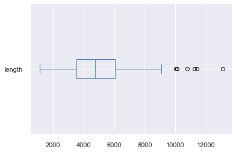
    

## Text processing:

In order be able to get meaningful and interesting insights from the texts at hand we needed to process them in order to diminish *noise* and bring them in a shape that will make them appropriate for analysis. 

Therefore we decided on a particular pipeline of processing steps which consisted of:

- **Lowercasing** all characters.
- **Dropping numbers**. This is an *optional* step which was left out at this particular stage because we neeeded number to extract decision year for example. However, it was used in topic modelling.
- **Removing punctuation**. Punctuation and other similar symbols, like dashes, etc. do not have particular semantic value.
- **Removing stopwords**. Stopwords have also low semantic value and is most of the times left out. Stopwords are language specific and vary according to the use case. The list of stopwords used in this project can be found [here](https://github.com/jethronap/AsylumData_KU/blob/main/misc/stopwords_dk.txt).
- **Single letter words** were dropped, too.
- **Tokenization**. All text we segmented at the word level and each word was treated as an individual token.
- **Lemmatization**. The process during which all words are turned into their roots.

As mentoned earlier, steps can be added or removed from the pipeline depending on the use case.

Below we can see the top 5 cases after being processed. Also, another column was added with the number of tokens produced.

<table border="1" class="dataframe">
  <thead>
    <tr style="text-align: right;">
      <th>id</th>
      <th>asylum_motive</th>
      <th>country</th>
      <th>text</th>
      <th>length</th>
      <th>tokens</th>
      <th>num_tokens</th>
    </tr>
  </thead>
  <tbody>
    <tr>
      <td>287</td>
      <td>[Etniske forhold]</td>
      <td>Ukendt hjemland</td>
      <td>Nævnet stadfæstede i november 2021 Udl...</td>
      <td>4753</td>
      <td>[stadfæste, 2021, udlændingestyrels, afgørelse...</td>
      <td>325</td>
    </tr>
    <tr>
      <td>515</td>
      <td>[Kriminelle forhold,  Militære forhold]</td>
      <td>Ukendt hjemland</td>
      <td>Nævnet stadfæstede i juni 2021 Udlændi...</td>
      <td>3149</td>
      <td>[stadfæste, 2021, udlændingestyrels, afgørelse...</td>
      <td>219</td>
    </tr>
    <tr>
      <td>551</td>
      <td>[Sur Place,  LGBT,  Politiske forhold,  Etnisk...</td>
      <td>Ukendt hjemland</td>
      <td>Nævnet stadfæstede i juni 2021 Udlændi...</td>
      <td>4433</td>
      <td>[stadfæste, 2021, udlændingestyrels, afgørelse...</td>
      <td>318</td>
    </tr>
    <tr>
      <td>989</td>
      <td>[Agents of Persecution,  Anden kønsrelateret f...</td>
      <td>Ukendt hjemland</td>
      <td>Nævnet stadfæstede i december 2020 Udl...</td>
      <td>2664</td>
      <td>[stadfæste, 2020, udlændingestyrels, afgørelse...</td>
      <td>184</td>
    </tr>
    <tr>
      <td>1379</td>
      <td>[Militære forhold,  Nationalitet]</td>
      <td>Ukendt hjemland</td>
      <td>Nævnet hjemviste i juni 2020 Udlænding...</td>
      <td>4626</td>
      <td>[hjemvise, 2020, udlændingestyrels, afgørelse,...</td>
      <td>324</td>
    </tr>
  </tbody>
</table>

## Exploratory descriptive analysis (EDA):

Through EDA we were able to extract features (information) from the case summary texts that we were not readily available. The main techique used was pattern matching through **Regular Expressions**. Regex, as they're called, are a sequence of characters (letter, numbers, etc.) that designate a search pattern in a text.

### Decision extraction:

Whether a case was **overturned** or **affirmed** was vital to the project because it brought this project inline with previous research.

> **Overturned** means that the Appeals Board's decision on the particular case disagrees with the one of Danish Immigration Services and thus is returned to them for reconsideration.

> **Affirmed** means the opposite. The Appeals board agrees with the decision of the Immigration services which usually means loss of asylum status or residence permit, etc. 

Below we can see the distribution of decision outcomes:

    
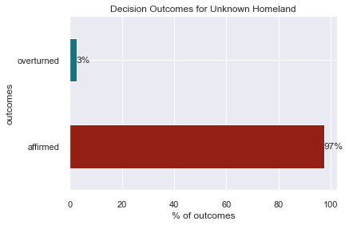
    

### Year extraction:

Another important feature was the year when a particular decision was taken. The following image presents the cummulative decision outcomes per year.

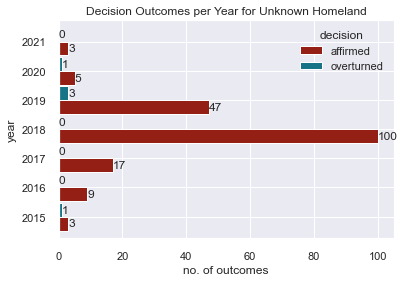
    
### Gender of applicants extraction:

The following plot shows the gender distribution of refugee applicants.
   
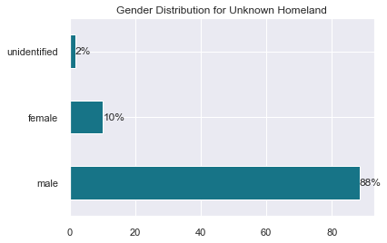

> **unidentified** means that the regex pattern used did not fully yield the expected results.    

Below we can see the decision outcome rate by gender. As seen there not a significant difference between men and women.
   
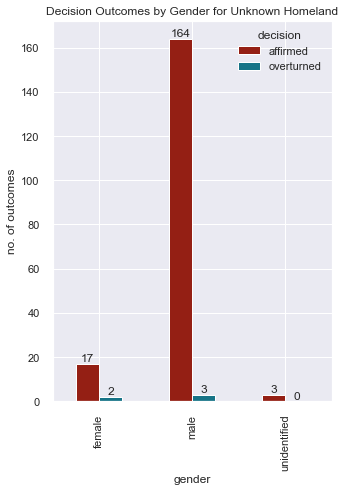

We can also get an idea of decision Outcome frequencies by gender for each year:

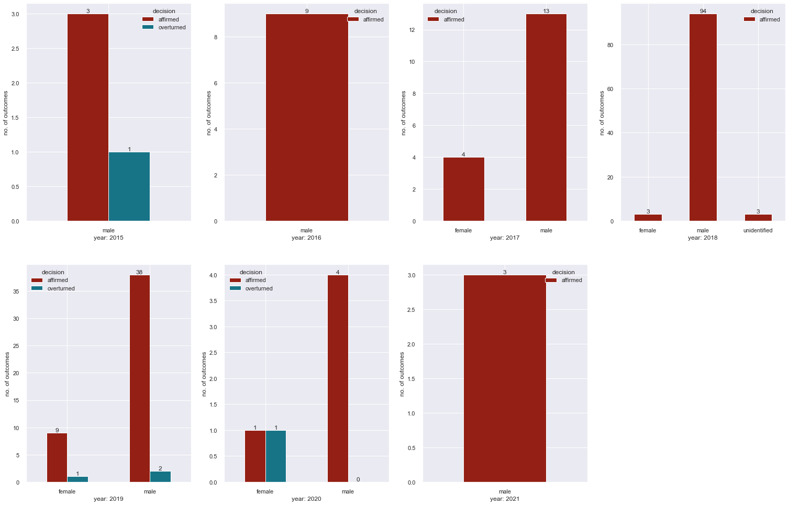
    

### Country of Origin extraction:

Although, we were looking into cases that were denoted as *Unknown Homeland*, research alongside domain experts and field visits lead to the realization that this kind of categorizations happen mostly on the side of the respective agenies and due to bureaucratic reasons. On the contrary, almost every refugee apeal text included a place or another as the country of origin of the applicant. Perhaps, only immigration laws can deny that *everyone comes from somewhere*.  
    
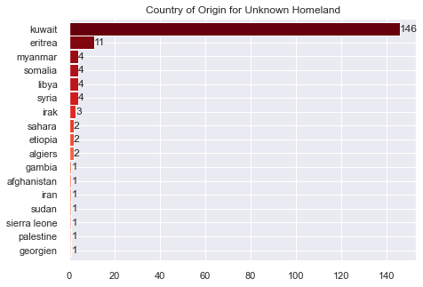
    
The following plot presents decision outcome rate by country of origin.
  
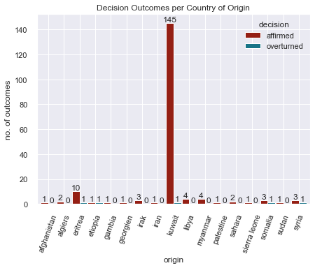
    

### Asylum motives distribution:

Below we can see the distribution of asylum motives for Unknown Homeland cases:

    Generelle forhold                  125
    Politiske forhold                   89
    Nationalitet                        75
    Etniske forhold                     53
    Sagsoplysning                       16
    Privatretlig forhold                14
    Beviskrav og bevisvurdering         11
    Udrejseforhold                       9
    Agents of Persecution                8
    Militære forhold                     6
    Ægteskabelige forhold                6
    Inddragelse/forlængelse              6
    Tortur                               6
    LGBT                                 4
    Seksuelle forhold                    3
    Chikane                              3
    Kriminelle forhold                   3
    Mindreårige                          2
    Tilknyt bistand oprørsgruppe         2
    Religiøse forhold                    2
    Privatretlig konflikt                2
    Sur Place                            2
    Anden kønsrelateret forfølgelse      1
    Overgreb                             1
    To-instansbehandling                 1

The following figure shows ten most frequent asylum motives.

    
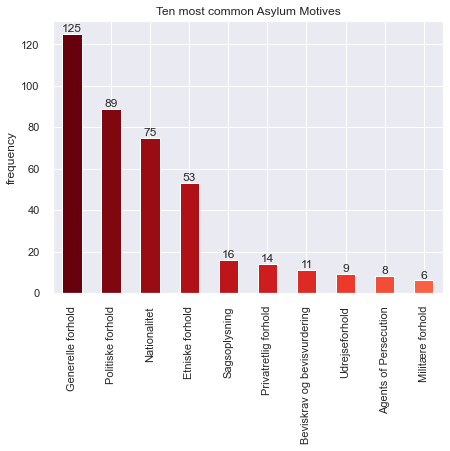
    
# Distribution of Bidoon cases:

As one can see from the country of origin distribution, the country with the most references is **Kuwait**. This realization when paired with other results from expert interviews lead the project to focus on **bidooners**. Bidoons are due to historical and political reasons stateless people from Kuwait.

Below we can see the comparison between Bidoons and other ethinicities mentioned in our dataset.    

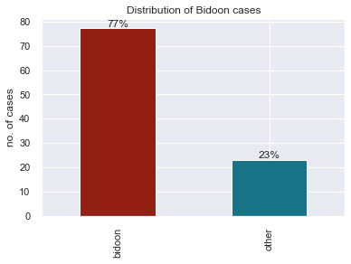
    
The following diagram depicts the yearly distribution of Bidoon cases.
    
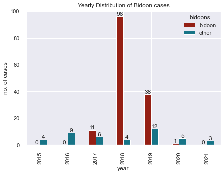

Here we can see the decision outcome rate for Bidoon cases.
    
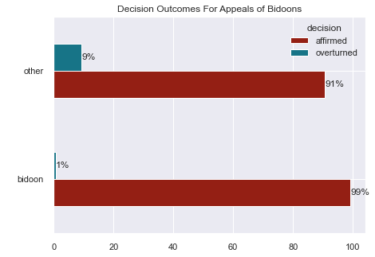
    

## Keyword in context (KWIC):

Implementing KWIC analysis is a way to search for specific keywords (terms) by producing a list of text fragments of equal length as they are shown left and right from a keyword. This provides a window we can call *context*.

For example we wanted to see the context around the word `efternavn` (surname in danish). We found 18 context instances of term.

    18 random samples out of 18 contexts for 'efternavn':
    ingsvis til de danske myndigheder oplyst at have efternavnet [C]. Ved fornyet afhøring i Danmark er  efternavn et angivet som [D], hvilket svarer til den mandlige ansøgers efternavn. I henhold til de græske mynd
    mark, som han ønskede at bo i nærheden af, og at der er navnesammenfald mellem denne familie og det  efternavn , ansøgeren er registreret med i Grækenland. Der er endvidere sammenfald med familiens nationalitet 
    er, at den kvindelige ansøger [F] ved indrejse i Grækenland er registreret som iraker med [et andet  efternavn ], og den kvindelige ansøger [G] ved indrejse i Ungarn er registreret som syrer med [et andet navn].
    tivet, jf. nærmere nedenfor – anses for påfaldende, at ansøgeren ved sin ankomst til Danmark brugte  efternavn et [AB], som også er hendes nuværende irakiske ægtefælles efternavn. Sprogtesten kan ikke føre til e
    e ansøgers efternavn. I henhold til de græske myndigheders registreringer har hun imidlertid oplyst  efternavn et [E]. Efter en samlet vurdering kan Flygtningenævnet herefter ikke lægge til grund, at ansøgerne e
    er, at den kvindelige ansøger [F] ved indrejse i Grækenland er registreret som iraker med [et andet  efternavn ], og den kvindelige ansøger [G] ved indrejse i Ungarn er registreret som syrer med [et andet navn].
    er, at den kvindelige ansøger [F] ved indrejse i Grækenland er registreret som iraker med [et andet  efternavn ], og den kvindelige ansøger [G] ved indrejse i Ungarn er registreret som syrer med [et andet navn].
    eder oplyste er den mandlige ansøger således registreret som værende fra Irak og med såvel et andet  efternavn  som en anden fødselsdato end meddelt de danske myndigheder. Den kvindelige ansøger er ligeledes reg
     venner på Facebook, der angiver at være fra Irak, herunder personen, [B], der har næsten det samme  efternavn , som ansøgeren har angivet i for-bindelse med asylansøgningen i Danmark. Det fremgår videre af Face
    , at han er irakisk statsborger fra en bestemt navngiven by i Irak, ligesom han har oplyst et andet  efternavn  og en anden fødselsdato end opgivet til de danske myndigheder. Ansøgerens bror og dennes familie ha
    er, at den kvindelige ansøger [F] ved indrejse i Grækenland er registreret som iraker med [et andet  efternavn ], og den kvindelige ansøger [G] ved indrejse i Ungarn er registreret som syrer med [et andet navn].
    ejse i Danmark over for de danske myndigheder oplyste, at de var irakiske statsborgere, og at deres  efternavn  var [et andet end oplyst af ansøgerne senere hen]. Ansøgerne er ikke fremkommet med en rimelig fork
    igheder. Den kvindelige ansøger har således indledningsvis til de danske myndigheder oplyst at have  efternavn et [C]. Ved fornyet afhøring i Danmark er efternavnet angivet som [D], hvilket svarer til den mandli
    s [ansøgerens tredje barn] har forklaret, at hun udelukkende kendte faderens fornavn, […], men ikke  efternavn et. Når disse og de øvrige divergerende forklaringer sammenholdes med ansøgernes meget begrænsede ev
    fornyet afhøring i Danmark er efternavnet angivet som [D], hvilket svarer til den mandlige ansøgers  efternavn . I henhold til de græske myndigheders registreringer har hun imidlertid oplyst efternavnet [E]. Eft
    d sin ankomst til Danmark brugte efternavnet [AB], som også er hendes nuværende irakiske ægtefælles  efternavn . Sprogtesten kan ikke føre til en anden vurdering af identitetsspørgsmålet. Ved vurderingen af ansø
    e myndigheder. Den kvindelige ansøger er ligeledes registreret som værende fra Irak og med et andet  efternavn  end meddelt de danske myndigheder. Den kvindelige ansøger har således indledningsvis til de danske 
    s egne oplysninger eller med oplysninger i familiens dokumenter, således at det alene er det sidste  efternavn , som adskiller sig. Disse personer har oplyst, at den mandlige ansøgers mor har boet i Irak. Hertil

Another example was the keyword `familie`. Below we can see ten random samples out of 601 contexts (i.e. instances of the keyword in the given corpus).

    10 random samples out of 601 contexts for 'familie':
    aft en central rolle i planlægningen eller udførelsen af hverken demonstrationen i 2014 eller 2015.  Familie n er kommet med forskellige oplysninger om, hvornår og hvor ofte familien er blevet opsøgt af de kuw
    s forklaringer om den mandlige ansøgers konflikt til grund, idet ansøgerne og den mandlige ansøgers  familie  har forklaret divergerende, herunder indbyrdes divergerende, og fordi flere dele af deres forklarin
    n ikke vidste, hvorfor hans og familien udrejse af Myanmar, og at han ikke var bekendt med, at hans  familie  havde haft problemer eller konflikter i Myanmar. For Flygtningenævnet har ansøgeren forklaret, at h
     familie udrejste illegalt med fly til Tyrkiet [i sommeren] 2015. Ansøgerens søster, [E], og hendes  familie  udrejste af Kuwait før ansøgerens familie og indrejste i Danmark før dem. Efterfølgende har[A] fået
    end 5 år siden. Ansøgeren har forklaret divergerende om, hvornår hans mor tog kontakt til bilistens  familie . Under oplysnings- og motivsamtalen forklarede han, at der gik to måneder, før hans mor første gang
    r oplyst, at ægtefællen samlet set blev anholdt 4-6 gange, og at samtlige anholdelser fandt sted på  familie ns bopæl. Ansøgeren har også oplyst, at ægtefællen i forbindelse med den seneste anholdelse blev løs
    s vægt på de ovennævnte omstændigheder i forbindelse med ægtefællens asylansøgning i Østrig og hans  familie s registrering som irakiske statsborgere i forbindelse med asylproceduren i andre europæiske lande. 
    arede 40 uger. Endelig har Flygtningenævnet lagt vægt på, at ansøgerne har forklaret, at de og hele  familie n, uden at blive opsøgt af myndighederne, kunne bo i [C], ca. 2 km fra deres hidtidige bopæl, i knap
     mostre, morfar og far, som stemmer overens med ansøgernes egne oplysninger eller med oplysninger i  familie ns dokumenter, således at det alene er det sidste efternavn, som adskiller sig. Disse personer har o
    med sine farbrødre. De fik hjælp af farbrorens ven ved navn [X] til at holde sig skjult. Ansøgerens  familie s bopæl blev opsøgt og ransaget flere gange efter demonstrationen, og familien besluttede herefter a

All of the above calls were made to the original **untokenized** & **unprocessed** dataset. Otherwise the context would not be easily discernible.

## Frequency analysis:

In this section we counted the most frequent tokens(terms) inside the **whole** corpus.

The table below presents top ten words.

<table border="1" class="dataframe">
  <thead>
    <tr style="text-align: right;">
      <th>token</th>
      <th>frequency</th>
    </tr>
  </thead>
  <tbody>
    <tr>
      <th>ansøger</th>
      <td>3630</td>
    </tr>
    <tr>
      <th>Kuwait</th>
      <td>1370</td>
    </tr>
    <tr>
      <th>forklare</th>
      <td>1237</td>
    </tr>
    <tr>
      <th>oplyse</th>
      <td>815</td>
    </tr>
    <tr>
      <th>myndighed</th>
      <td>796</td>
    </tr>
    <tr>
      <th>mandlig</th>
      <td>794</td>
    </tr>
    <tr>
      <th>asylmotiv</th>
      <td>749</td>
    </tr>
    <tr>
      <th>forklaring</th>
      <td>675</td>
    </tr>
    <tr>
      <th>lægge</th>
      <td>649</td>
    </tr>
    <tr>
      <th>demonstration</th>
      <td>629</td>
    </tr>
  </tbody>
</table>

The same distribution presented through a horizontal barplot.
    
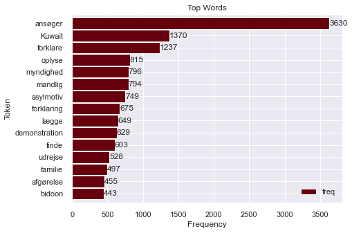
    

## N-gram analysis:

You can check out the theory section of this report to get some insights regarding **n-grams**. They are for the most part combinations of words. For this project we wanted to see *pairs* of words with the highest frequency. The following diagram presents just that.
    
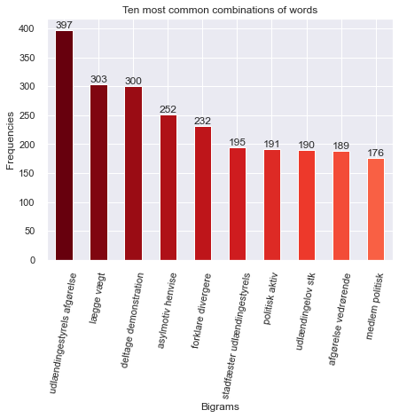
    

## TF-IDF

Again, **TF-IDF** is briefly explained in the theory section. In short, TF-IDF is a score given to each word. Having a high TF-IDF score means that this term can 'characterize' the whole corpus. Be careful this is not to be mixed with the notion of the most frequent word (highest frequency). By 'characterizing' a corpus means that this term is *special* for the corpus after having left out all other terms which are very common. This means that a high TF-IDF score is given to words with special weight on a corpus.

In order to get to TF-IDF scoring we need to create a vocabulary of all terms in our corpus after having processed all texts. The shape of the resulting vector of the vocabulary created from our given corpus consists of 189 texts with 4312 terms (or dimensions).

Below we can see 10 random terms from the produced vocabulary:

    ['stadfæste',
     '2021',
     'udlændingestyrels',
     'afgørelse',
     'vedrørende',
     'mandlig',
     'statsborger',
     'ukendt',
     'hjemland',
     'indrejst']

The following table presents a peak of the documents and their respective terms with their TF-IDF scores.

<table border="1" class="dataframe">
  <thead>
    <tr style="text-align: right;">
      <th></th>
      <th>doc</th>
      <th>keywords</th>
    </tr>
  </thead>
  <tbody>
    <tr>
      <th>0</th>
      <td>stadfæste 2021 udlændingestyrels afgørelse ved...</td>
      <td>{'myanmar': 0.398, 'rohingya': 0.298, 'ansøger...</td>
    </tr>
    <tr>
      <th>1</th>
      <td>stadfæste 2021 udlændingestyrels afgørelse ved...</td>
      <td>{'algerium': 0.398, 'ansøger': 0.36, 'frankrig...</td>
    </tr>
    <tr>
      <th>2</th>
      <td>stadfæste 2021 udlændingestyrels afgørelse ved...</td>
      <td>{'ansøger': 0.323, 'sudan': 0.291, '2020': 0.2...</td>
    </tr>
    <tr>
      <th>3</th>
      <td>stadfæste 2020 udlændingestyrels afgørelse ved...</td>
      <td>{'somalia': 0.435, 'alshabaab': 0.419, 'kenya'...</td>
    </tr>
    <tr>
      <th>4</th>
      <td>hjemvise 2020 udlændingestyrels afgørelse vedr...</td>
      <td>{'eritreisk': 0.402, 'eritrea': 0.352, 'etiopi...</td>
    </tr>
    <tr>
      <th>...</th>
      <td>...</td>
      <td>...</td>
    </tr>
    <tr>
      <th>184</th>
      <td>stadfæste 2016 udlændingestyrels afgørelse ved...</td>
      <td>{'fader': 0.475, 'liyu': 0.351, 'police': 0.30...</td>
    </tr>
    <tr>
      <th>185</th>
      <td>stadfæste 2015 udlændingestyrels afgørelse ved...</td>
      <td>{'onlf': 0.436, 'police': 0.311, 'liyu': 0.311...</td>
    </tr>
    <tr>
      <th>186</th>
      <td>hjemvise 2015 udlændingestyrels afgørelse vedr...</td>
      <td>{'etiopien': 0.197, 'hjemvise': 0.188, 'foreta...</td>
    </tr>
    <tr>
      <th>187</th>
      <td>stadfæste 2015 udlændingestyrels afgørelse ved...</td>
      <td>{'soldat': 0.536, 'burmesisk': 0.216, 'burma':...</td>
    </tr>
    <tr>
      <th>188</th>
      <td>stadfæste 2015 udlændingestyrels afgørelse ved...</td>
      <td>{'algerium': 0.473, 'ukendt': 0.296, 'senest':...</td>
    </tr>
  </tbody>
</table>

Finally we can see the top 20 most common words based on their TF-IDF scores.

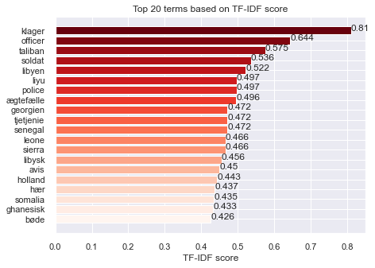
    

