# Unknown Homeland cases EDA:

# Import data set:

Below we see the shape of the whole dataset.

    (9635, 5)

# Dataset preprocessing:

Cases of Unknown Homeland (Ukendt hjemland) are kept.

Below we see the shape and head of the dataset.

    (192, 4)

<table border="1" class="dataframe">
  <thead>
    <tr style="text-align: right;">
      <th></th>
      <th>id</th>
      <th>asylum_motive</th>
      <th>country</th>
      <th>text</th>
    </tr>
  </thead>
  <tbody>
    <tr>
      <th>287</th>
      <td>287</td>
      <td>[Etniske forhold]</td>
      <td>Ukendt hjemland</td>
      <td>Nævnet stadfæstede i november 2021 Udl...</td>
    </tr>
    <tr>
      <th>515</th>
      <td>515</td>
      <td>[Kriminelle forhold,  Militære forhold]</td>
      <td>Ukendt hjemland</td>
      <td>Nævnet stadfæstede i juni 2021 Udlændi...</td>
    </tr>
    <tr>
      <th>551</th>
      <td>551</td>
      <td>[Sur Place,  LGBT,  Politiske forhold,  Etnisk...</td>
      <td>Ukendt hjemland</td>
      <td>Nævnet stadfæstede i juni 2021 Udlændi...</td>
    </tr>
    <tr>
      <th>989</th>
      <td>989</td>
      <td>[Agents of Persecution,  Anden kønsrelateret f...</td>
      <td>Ukendt hjemland</td>
      <td>Nævnet stadfæstede i december 2020 Udl...</td>
    </tr>
    <tr>
      <th>1379</th>
      <td>1379</td>
      <td>[Militære forhold,  Nationalitet]</td>
      <td>Ukendt hjemland</td>
      <td>Nævnet hjemviste i juni 2020 Udlænding...</td>
    </tr>
  </tbody>
</table>

Check for potential duplicates and drop them:

<table border="1" class="dataframe">
  <thead>
    <tr style="text-align: right;">
      <th></th>
      <th>id</th>
      <th>asylum_motive</th>
      <th>country</th>
      <th>text</th>
    </tr>
  </thead>
  <tbody>
    <tr>
      <th>1421</th>
      <td>1421</td>
      <td>[Inddragelse/forlængelse,  Religiøse forhold, ...</td>
      <td>Ukendt hjemland</td>
      <td>Nævnet stadfæstede i maj 2020 Udlændin...</td>
    </tr>
    <tr>
      <th>1440</th>
      <td>1440</td>
      <td>[Inddragelse/forlængelse,  Religiøse forhold, ...</td>
      <td>Ukendt hjemland</td>
      <td>Nævnet stadfæstede i maj 2020 Udlændin...</td>
    </tr>
    <tr>
      <th>4102</th>
      <td>4102</td>
      <td>[Politiske forhold,  Generelle forhold]</td>
      <td>Ukendt hjemland</td>
      <td>Nævnet stadfæstede i januar 2018 Udlæn...</td>
    </tr>
    <tr>
      <th>4103</th>
      <td>4103</td>
      <td>[Privatretlig forhold,  Generelle forhold]</td>
      <td>Ukendt hjemland</td>
      <td>Nævnet stadfæstede i januar 2018 Udlæn...</td>
    </tr>
    <tr>
      <th>4157</th>
      <td>4157</td>
      <td>[Nationalitet,  Generelle forhold,  Udrejsefor...</td>
      <td>Ukendt hjemland</td>
      <td>Nævnet stadfæstede i januar 2018 Udlæn...</td>
    </tr>
    <tr>
      <th>4160</th>
      <td>4160</td>
      <td>[Emneord:]</td>
      <td>Ukendt hjemland</td>
      <td>Nævnet stadfæstede i januar 2018 Udlæn...</td>
    </tr>
  </tbody>
</table>

    (189, 4)

## Length of texts

Create a numeric column in order to get a feel about the length of the texts.

<table border="1" class="dataframe">
  <thead>
    <tr style="text-align: right;">
      <th></th>
      <th>count</th>
      <th>mean</th>
      <th>std</th>
      <th>min</th>
      <th>25%</th>
      <th>50%</th>
      <th>75%</th>
      <th>max</th>
    </tr>
  </thead>
  <tbody>
    <tr>
      <th>id</th>
      <td>189.0</td>
      <td>3296.661376</td>
      <td>1225.330399</td>
      <td>287.0</td>
      <td>2632.0</td>
      <td>3128.0</td>
      <td>3933.0</td>
      <td>7295.0</td>
    </tr>
    <tr>
      <th>length</th>
      <td>189.0</td>
      <td>5008.539683</td>
      <td>2046.292952</td>
      <td>1104.0</td>
      <td>3532.0</td>
      <td>4753.0</td>
      <td>6057.0</td>
      <td>13105.0</td>
    </tr>
  </tbody>
</table>

## Boxplot:

    <AxesSubplot:>

    

    

# Create a pipeline:

The pipeline consists of the following steps:

- Lowercase all characters
- Drop numbers
- Remove punctuation
- Remove stopwords. The list of stopwords can be found [here](https://github.com/jethronap/AsylumData_KU/blob/main/misc/stopwords_dk.txt).
- Single letter words are dropped, too.
- Tokenization
- Lemmatization. The process during which all words are turned into its roots.

Steps can be added or removed from the pipeline.

<table border="1" class="dataframe">
  <thead>
    <tr style="text-align: right;">
      <th></th>
      <th>id</th>
      <th>asylum_motive</th>
      <th>country</th>
      <th>text</th>
      <th>length</th>
      <th>tokens</th>
      <th>num_tokens</th>
    </tr>
  </thead>
  <tbody>
    <tr>
      <th>287</th>
      <td>287</td>
      <td>[Etniske forhold]</td>
      <td>Ukendt hjemland</td>
      <td>Nævnet stadfæstede i november 2021 Udl...</td>
      <td>4753</td>
      <td>[stadfæste, 2021, udlændingestyrels, afgørelse...</td>
      <td>325</td>
    </tr>
    <tr>
      <th>515</th>
      <td>515</td>
      <td>[Kriminelle forhold,  Militære forhold]</td>
      <td>Ukendt hjemland</td>
      <td>Nævnet stadfæstede i juni 2021 Udlændi...</td>
      <td>3149</td>
      <td>[stadfæste, 2021, udlændingestyrels, afgørelse...</td>
      <td>219</td>
    </tr>
    <tr>
      <th>551</th>
      <td>551</td>
      <td>[Sur Place,  LGBT,  Politiske forhold,  Etnisk...</td>
      <td>Ukendt hjemland</td>
      <td>Nævnet stadfæstede i juni 2021 Udlændi...</td>
      <td>4433</td>
      <td>[stadfæste, 2021, udlændingestyrels, afgørelse...</td>
      <td>318</td>
    </tr>
    <tr>
      <th>989</th>
      <td>989</td>
      <td>[Agents of Persecution,  Anden kønsrelateret f...</td>
      <td>Ukendt hjemland</td>
      <td>Nævnet stadfæstede i december 2020 Udl...</td>
      <td>2664</td>
      <td>[stadfæste, 2020, udlændingestyrels, afgørelse...</td>
      <td>184</td>
    </tr>
    <tr>
      <th>1379</th>
      <td>1379</td>
      <td>[Militære forhold,  Nationalitet]</td>
      <td>Ukendt hjemland</td>
      <td>Nævnet hjemviste i juni 2020 Udlænding...</td>
      <td>4626</td>
      <td>[hjemvise, 2020, udlændingestyrels, afgørelse,...</td>
      <td>324</td>
    </tr>
  </tbody>
</table>

# Analysis:

## Exploratory descriptive analysis (EDA):

## Decision extraction:

Plot decision outcomes:

    Text(0, 0.5, 'outcomes')

    
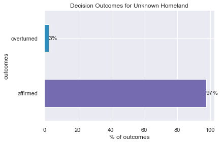
    

## Year extraction:

Plot decision outcomes by year:

    
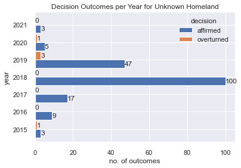
    

## Gender of applicants extraction:

Plot gender distribution:

NOTE: unidentified means that the regex pattern used does not fully yield the expected results.

    
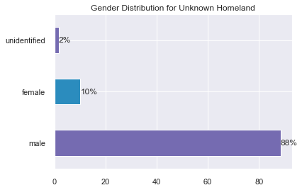
    

Plot decision outcome rate by gender:

    
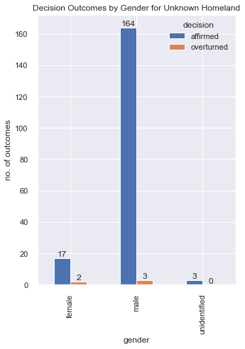
    

Plot Decision Outcome Frequencies by Gender for each Year:

    
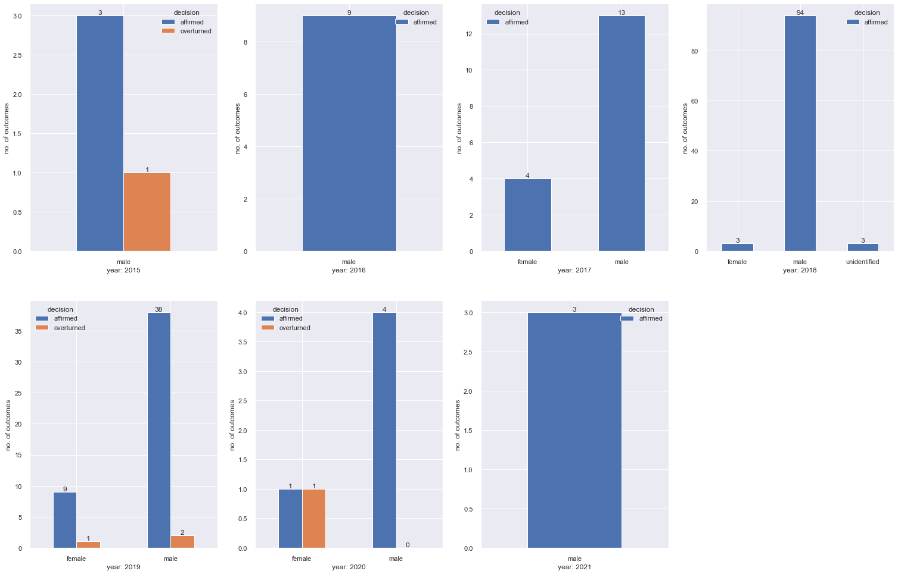
    

## Extract Country of Origin:

Plot distribution of origin:

    
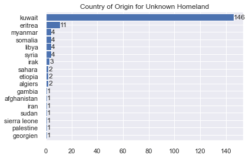
    

Plot decision outcome rate by origin:

    
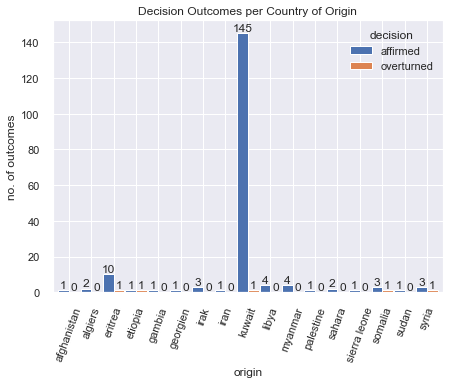
    

# Asylum motives distribution:

    Generelle forhold                  125
    Politiske forhold                   89
    Nationalitet                        75
    Etniske forhold                     53
    Sagsoplysning                       16
    Privatretlig forhold                14
    Beviskrav og bevisvurdering         11
    Udrejseforhold                       9
    Agents of Persecution                8
    Militære forhold                     6
    Ægteskabelige forhold                6
    Inddragelse/forlængelse              6
    Tortur                               6
    LGBT                                 4
    Seksuelle forhold                    3
    Chikane                              3
    Kriminelle forhold                   3
    Mindreårige                          2
    Tilknyt bistand oprørsgruppe         2
    Religiøse forhold                    2
    Privatretlig konflikt                2
    Sur Place                            2
    Anden kønsrelateret forfølgelse      1
    Overgreb                             1
    To-instansbehandling                 1
    Emneord:                             1
    Name: asylum_motive, dtype: int64

Plot ten most frequent asylum motives:

    Text(0, 0.5, 'frequency')

    
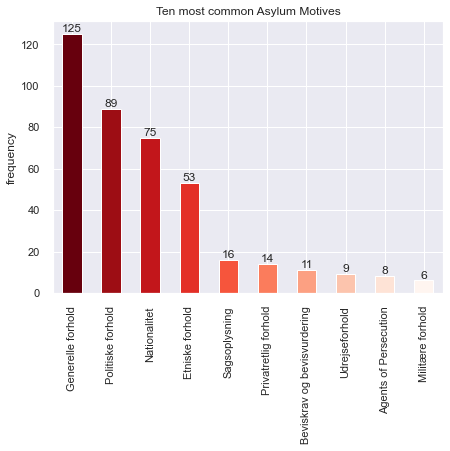
    

# Set of locations referred in UH appeals:

    [{('bangladesh', 'LOC'),
      ('damaskus', 'LOC'),
      ('danmark', 'LOC'),
      ('dhaka', 'LOC'),
      ('europa', 'LOC'),
      ('holland', 'LOC'),
      ('istanbul', 'LOC'),
      ('minbya', 'LOC'),
      ('myanmar', 'LOC'),
      ('rohingyaer', 'LOC'),
      ('singapore', 'LOC'),
      ('syrien', 'LOC')},
     {('algeriet', 'LOC'),
      ('algeriets', 'LOC'),
      ('algier', 'LOC'),
      ('casablanca', 'LOC'),
      ('danmark', 'LOC'),
      ('frankrig', 'LOC'),
      ('marokko', 'LOC'),
      ('sverige', 'LOC')},
     {('australien', 'LOC'),
      ('danmark', 'LOC'),
      ('juba', 'LOC'),
      ('south sudan', 'LOC'),
      ('sprogtests', 'LOC'),
      ('sudan', 'LOC'),
      ('sydsudan', 'LOC')},
     {('danmark', 'LOC'), ('kenya', 'LOC'), ('somalia', 'LOC')},
     {('eritrea', 'LOC'), ('etiopien', 'LOC'), ('sudan', 'LOC')},
     {('danmark', 'LOC'),
      ('europa', 'LOC'),
      ('holland', 'LOC'),
      ('iran', 'LOC'),
      ('kobala', 'LOC')},
     {('danmark', 'LOC'),
      ('eritrea', 'LOC'),
      ('etiopien', 'LOC'),
      ('italien', 'LOC'),
      ('libyen', 'LOC')},
     {('kuwait', 'LOC')},
     {('4.-17', 'LOC'),
      ('bangladesh', 'LOC'),
      ('danmark', 'LOC'),
      ('grækenland', 'LOC'),
      ('indien', 'LOC'),
      ('karachi', 'LOC'),
      ('myanmar', 'LOC'),
      ('pakistan', 'LOC'),
      ('spanien', 'LOC'),
      ('thailand', 'LOC')},
     {('amman', 'LOC'),
      ('damaskus', 'LOC'),
      ('danmark', 'LOC'),
      ('grækenland', 'LOC'),
      ('syrien', 'LOC'),
      ('tyrkiet', 'LOC'),
      ('tyskland', 'LOC')},
     {('danmark', 'LOC'),
      ('grækenland', 'LOC'),
      ('irak', 'LOC'),
      ('iraker', 'LOC'),
      ('kuwait', 'LOC'),
      ('ungarn', 'LOC')},
     {('danmark', 'LOC'),
      ('grækenland', 'LOC'),
      ('irak', 'LOC'),
      ('iraker', 'LOC'),
      ('kuwait', 'LOC'),
      ('ungarn', 'LOC')},
     {('danmark', 'LOC'),
      ('grækenland', 'LOC'),
      ('irak', 'LOC'),
      ('iraker', 'LOC'),
      ('iran', 'LOC'),
      ('kuwait', 'LOC'),
      ('ungarn', 'LOC')},
     {('danmark', 'LOC'),
      ('grækenland', 'LOC'),
      ('hjem/2019/45/', 'LOC'),
      ('irak', 'LOC'),
      ('iraker', 'LOC'),
      ('kuwait', 'LOC'),
      ('ungarn', 'LOC')},
     {('idlib', 'LOC'), ('libanon', 'LOC'), ('syrien', 'LOC')},
     {('damaskus', 'LOC'),
      ('daraa', 'LOC'),
      ('edirne', 'LOC'),
      ('syrien', 'LOC'),
      ('tyrkiet', 'LOC')},
     {('danmark', 'LOC'),
      ('grækenland', 'LOC'),
      ('irak', 'LOC'),
      ('kuwait', 'LOC')},
     {('kuwait', 'LOC')},
     {('danmark', 'LOC'),
      ('frankrig', 'LOC'),
      ('georgien', 'LOC'),
      ('rusland', 'LOC'),
      ('tbilisi', 'LOC'),
      ('tjetjenien', 'LOC')},
     {('danmark', 'LOC'), ('irak', 'LOC'), ('kuwait', 'LOC')},
     {('danmark', 'LOC'),
      ('grækenland', 'LOC'),
      ('kuwait', 'LOC'),
      ('landinfos', 'LOC')},
     {('damaskus', 'LOC'),
      ('danmark', 'LOC'),
      ('europa', 'LOC'),
      ('gensamtalen', 'LOC'),
      ('grækenland', 'LOC'),
      ('homs', 'LOC'),
      ('iran', 'LOC'),
      ('istanbul', 'LOC'),
      ('kuwait', 'LOC'),
      ('libanon', 'LOC'),
      ('syrien', 'LOC'),
      ('tyrkiet', 'LOC')},
     {('finland', 'LOC'),
      ('irak', 'LOC'),
      ('iran', 'LOC'),
      ('kalar', 'LOC'),
      ('koye', 'LOC'),
      ('sabah moradi', 'LOC'),
      ('østrig', 'LOC')},
     {('eritrea', 'LOC'), ('sudan', 'LOC')},
     {('bangladesh', 'LOC'),
      ('burma', 'LOC'),
      ('comilla', 'LOC'),
      ('danmark', 'LOC'),
      ('myanmar', 'LOC'),
      ('tuku', 'LOC')},
     {('kuwait', 'LOC')},
     {('irak', 'LOC'), ('kuwait', 'LOC'), ('taima', 'LOC'), ('tyskland', 'LOC')},
     {('kuwait', 'LOC')},
     {('europa', 'LOC'), ('grækenland', 'LOC'), ('kuwait', 'LOC')},
     {('europa', 'LOC'), ('grækenland', 'LOC'), ('kuwait', 'LOC')},
     {('europa', 'LOC'), ('grækenland', 'LOC'), ('kuwait', 'LOC')},
     {('[d', 'LOC'),
      ('europa', 'LOC'),
      ('farwaniyah', 'LOC'),
      ('grækenland', 'LOC'),
      ('kuwait', 'LOC'),
      ('taima', 'LOC')},
     {('danmark', 'LOC'),
      ('diwaniyaen', 'LOC'),
      ('grækenland', 'LOC'),
      ('kuwait', 'LOC'),
      ('landinfo', 'LOC'),
      ('landinfos', 'LOC')},
     {('danmark', 'LOC'),
      ('diwaniyaen', 'LOC'),
      ('grækenland', 'LOC'),
      ('kuwait', 'LOC'),
      ('landinfo', 'LOC'),
      ('landinfos', 'LOC')},
     {('danmark', 'LOC'),
      ('diwaniyaen', 'LOC'),
      ('grækenland', 'LOC'),
      ('kuwait', 'LOC'),
      ('landinfo', 'LOC'),
      ('landinfos', 'LOC')},
     {('danmark', 'LOC'),
      ('diwaniyaen', 'LOC'),
      ('grækenland', 'LOC'),
      ('kuwait', 'LOC'),
      ('landinfo', 'LOC'),
      ('landinfos', 'LOC')},
     {('dakar', 'LOC'), ('danmark', 'LOC'), ('gambia', 'LOC'), ('senegal', 'LOC')},
     {('grækenland', 'LOC'), ('kuwait', 'LOC'), ('kuwait city', 'LOC')},
     {('danmark', 'LOC'), ('doha', 'LOC'), ('jahra', 'LOC'), ('kuwait', 'LOC')},
     {('danmark', 'LOC'), ('kuwait', 'LOC')},
     {('danmark', 'LOC'), ('kuwait', 'LOC'), ('sverige', 'LOC')},
     {('eritrea', 'LOC'),
      ('etiopien', 'LOC'),
      ('europa', 'LOC'),
      ('sudan', 'LOC')},
     {('abu muslim al-khulani', 'LOC'),
      ('danmark', 'LOC'),
      ('grækenland', 'LOC'),
      ('irak', 'LOC'),
      ('kuwait', 'LOC'),
      ('tyrkiet', 'LOC')},
     {('demon-strationen', 'LOC'),
      ('europa', 'LOC'),
      ('grækenland', 'LOC'),
      ('kuwait', 'LOC'),
      ('op-lysnings-', 'LOC')},
     {('europa', 'LOC'), ('grækenland', 'LOC'), ('kuwait', 'LOC')},
     {('europa', 'LOC'), ('grækenland', 'LOC'), ('kuwait', 'LOC')},
     {('europa', 'LOC'),
      ('grækenland', 'LOC'),
      ('kuwait', 'LOC'),
      ('op-lysnings-', 'LOC')},
     {('[d', 'LOC'),
      ('europa', 'LOC'),
      ('farwaniyah', 'LOC'),
      ('grækenland', 'LOC'),
      ('kuwait', 'LOC'),
      ('op-lysnings-', 'LOC'),
      ('taima', 'LOC')},
     {('beirut', 'LOC'),
      ('danmark', 'LOC'),
      ('libanon', 'LOC'),
      ('syrien', 'LOC'),
      ('tripoli', 'LOC'),
      ('tyrkiet', 'LOC')},
     {('abu haitman', 'LOC'), ('kuwait', 'LOC'), ('taima', 'LOC')},
     {('afghanistan', 'LOC'), ('kabul', 'LOC'), ('talibans', 'LOC')},
     {('kuwait', 'LOC')},
     {('danmark', 'LOC'), ('europa', 'LOC'), ('kuwait', 'LOC')},
     {('grækenland', 'LOC'),
      ('kuwait', 'LOC'),
      ('sprogtests', 'LOC'),
      ('tyrkiet', 'LOC')},
     {('kuwait', 'LOC')},
     {('irak', 'LOC'), ('kuwait', 'LOC'), ('london', 'LOC')},
     {('danmark', 'LOC'),
      ('england', 'LOC'),
      ('kuwait', 'LOC'),
      ('ukendt/2018/102/', 'LOC')},
     {('danmarks', 'LOC'),
      ('mogadishu', 'LOC'),
      ('somalia', 'LOC'),
      ('storbritannien', 'LOC')},
     {('danmark', 'LOC'),
      ('kroatien', 'LOC'),
      ('kuwait', 'LOC'),
      ('tyskland', 'LOC')},
     {('danmark', 'LOC'),
      ('hjem/2019/1/jabp', 'LOC'),
      ('kroatien', 'LOC'),
      ('kuwait', 'LOC'),
      ('tyskland', 'LOC')},
     {('danmark', 'LOC'), ('england', 'LOC'), ('kuwait', 'LOC')},
     {('kuwait', 'LOC')},
     {('irak', 'LOC'), ('kuwait', 'LOC')},
     {('bahrain', 'LOC'),
      ('de forenede arabiske emirater', 'LOC'),
      ('england', 'LOC'),
      ('kuwait', 'LOC'),
      ('kuwaits', 'LOC'),
      ('landinfos', 'LOC'),
      ('qatar', 'LOC'),
      ('saudi arabien', 'LOC')},
     {('irak', 'LOC'), ('kuwait', 'LOC'), ('taima', 'LOC')},
     {('kuwait', 'LOC')},
     {('kuwait', 'LOC')},
     {('danmark', 'LOC'),
      ('farwaniah', 'LOC'),
      ('grækenland', 'LOC'),
      ('kuwait', 'LOC'),
      ('landinfos', 'LOC')},
     {('iraker', 'LOC'), ('kuwait', 'LOC'), ('sprogtests', 'LOC')},
     {('libyen', 'LOC'),
      ('libyens', 'LOC'),
      ('muammar gaddafi', 'LOC'),
      ('ungarn', 'LOC'),
      ('østrig', 'LOC')},
     {('danmark', 'LOC'), ('irak', 'LOC'), ('kuwait', 'LOC'), ('kuwaits', 'LOC')},
     {('danmark', 'LOC'),
      ('england', 'LOC'),
      ('grækenland', 'LOC'),
      ('irak', 'LOC'),
      ('kuwait', 'LOC'),
      ('kuwaits', 'LOC'),
      ('tyrkiet', 'LOC')},
     {('irak', 'LOC'), ('kuwait', 'LOC'), ('syrien', 'LOC'), ('ungarn', 'LOC')},
     {('danmark', 'LOC'),
      ('irak', 'LOC'),
      ('kuwait', 'LOC'),
      ('landinfo', 'LOC'),
      ('syrien', 'LOC')},
     {('danmark', 'LOC'),
      ('europa', 'LOC'),
      ('hjem/2018/95/jabp', 'LOC'),
      ('irak', 'LOC'),
      ('kuwait', 'LOC'),
      ('syrien', 'LOC'),
      ('ungarn', 'LOC')},
     {('danmark', 'LOC'), ('europa', 'LOC'), ('irak', 'LOC'), ('kuwait', 'LOC')},
     {('danmark', 'LOC'), ('syrien', 'LOC')},
     {('danmark', 'LOC'), ('kuwait', 'LOC'), ('taima', 'LOC')},
     {('irak', 'LOC'), ('kuwait', 'LOC'), ('taima', 'LOC')},
     {('irak', 'LOC'), ('kuwait', 'LOC'), ('taima', 'LOC')},
     {('irak', 'LOC'), ('kuwait', 'LOC')},
     {('danmark', 'LOC'), ('irak', 'LOC'), ('kuwait', 'LOC')},
     {('[a]', 'LOC'), ('kuwait', 'LOC')},
     {('england', 'LOC'),
      ('grækenland', 'LOC'),
      ('kuwait', 'LOC'),
      ('rahayya', 'LOC'),
      ('tyrkiet', 'LOC')},
     {('[a', 'LOC'),
      ('danmark', 'LOC'),
      ('grækenland', 'LOC'),
      ('kuwait', 'LOC'),
      ('tyrkiet', 'LOC')},
     {('bahrain', 'LOC'),
      ('danmark', 'LOC'),
      ('de forenede arabiske emirater', 'LOC'),
      ('gensamtalen', 'LOC'),
      ('irak', 'LOC'),
      ('jahra', 'LOC'),
      ('kuwait', 'LOC'),
      ('qatar', 'LOC'),
      ('saudi arabien', 'LOC')},
     {('bahrain', 'LOC'),
      ('de forenede arabiske emirater', 'LOC'),
      ('gensamtalen', 'LOC'),
      ('irak', 'LOC'),
      ('kuwait', 'LOC'),
      ('qatar', 'LOC'),
      ('saudi arabien', 'LOC')},
     {('danmark', 'LOC'),
      ('iraker', 'LOC'),
      ('kuwait', 'LOC'),
      ('tyrkiet', 'LOC')},
     {('danmark', 'LOC'), ('kuwait', 'LOC')},
     {('kuwait', 'LOC')},
     {('casablanca', 'LOC'),
      ('marokko', 'LOC'),
      ('polisario', 'LOC'),
      ('sahara', 'LOC'),
      ('spanien', 'LOC'),
      ('vestsahara', 'LOC')},
     {('danmark', 'LOC'), ('irak', 'LOC'), ('kuwait', 'LOC')},
     {('danmark', 'LOC'),
      ('grækenland', 'LOC'),
      ('irak', 'LOC'),
      ('kuwait', 'LOC')},
     {('bulgarien', 'LOC'),
      ('danmark', 'LOC'),
      ('irak', 'LOC'),
      ('kuwait', 'LOC')},
     {('danmark', 'LOC'), ('kuwait', 'LOC')},
     {('grækenland', 'LOC'),
      ('irak', 'LOC'),
      ('kuwait', 'LOC'),
      ('tyrkiet', 'LOC')},
     {('danmark', 'LOC'),
      ('europa', 'LOC'),
      ('jahra', 'LOC'),
      ('kuwait', 'LOC'),
      ('middelhavet', 'LOC'),
      ('taima', 'LOC')},
     {('danmark', 'LOC'),
      ('grækenland', 'LOC'),
      ('irak', 'LOC'),
      ('kuwait', 'LOC'),
      ('middelhavet', 'LOC')},
     {('frihedspladsen', 'LOC'), ('kuwait', 'LOC'), ('ungarn', 'LOC')},
     {('kuwait', 'LOC')},
     {('kuwait', 'LOC')},
     {('kuwait', 'LOC'), ('tamia', 'LOC')},
     {('kuwait', 'LOC'), ('taima', 'LOC')},
     {('kuwait', 'LOC')},
     {('algeriet', 'LOC'),
      ('danmark', 'LOC'),
      ('israel', 'LOC'),
      ('libyen', 'LOC'),
      ('marokko', 'LOC'),
      ('muammar gaddafi', 'LOC'),
      ('nordafrika', 'LOC'),
      ('schweiz', 'LOC'),
      ('tripoli', 'LOC')},
     {('kuwait', 'LOC')},
     {('irak', 'LOC'), ('kabd', 'LOC'), ('kuwait', 'LOC')},
     {('irak', 'LOC'), ('kuwait', 'LOC')},
     {('danmark', 'LOC'), ('kuwait', 'LOC')},
     {('grækenland', 'LOC'),
      ('hjem/2018/46/', 'LOC'),
      ('irak', 'LOC'),
      ('kuwait', 'LOC')},
     {('belgien', 'LOC'),
      ('danmark', 'LOC'),
      ('grækenland', 'LOC'),
      ('irak', 'LOC'),
      ('kuwait', 'LOC'),
      ('landinfos', 'LOC'),
      ('sprogtests', 'LOC')},
     {('belgien', 'LOC'),
      ('danmark', 'LOC'),
      ('grækenland', 'LOC'),
      ('irak', 'LOC'),
      ('kuwait', 'LOC'),
      ('landinfos', 'LOC'),
      ('sprogtests', 'LOC')},
     {('abu nasir', 'LOC'), ('kuwait', 'LOC')},
     {('irak', 'LOC'), ('kuwait', 'LOC'), ('tyrkiet', 'LOC')},
     {('irak', 'LOC'),
      ('kuwait', 'LOC'),
      ('storbritannien', 'LOC'),
      ('tyrkiet', 'LOC')},
     {('england', 'LOC'),
      ('irak', 'LOC'),
      ('kuwait', 'LOC'),
      ('landinfos', 'LOC')},
     {('england', 'LOC'),
      ('irak', 'LOC'),
      ('kuwait', 'LOC'),
      ('landinfos', 'LOC')},
     {('kuwait', 'LOC'), ('taimaa', 'LOC')},
     {('grækenland', 'LOC'), ('irak', 'LOC'), ('kuwait', 'LOC')},
     {('danmark', 'LOC'),
      ('grækenland', 'LOC'),
      ('irak', 'LOC'),
      ('kuwait', 'LOC'),
      ('london', 'LOC'),
      ('tyrkiet', 'LOC'),
      ('tyskland', 'LOC')},
     {('al-haria torvet', 'LOC'),
      ('danmark', 'LOC'),
      ('grækenland', 'LOC'),
      ('kuwait', 'LOC'),
      ('taima', 'LOC')},
     {('danmark', 'LOC'),
      ('grækenland', 'LOC'),
      ('iran', 'LOC'),
      ('kuwait', 'LOC'),
      ('sverige', 'LOC')},
     {('danmark', 'LOC'),
      ('europa', 'LOC'),
      ('grækenland', 'LOC'),
      ('iran', 'LOC'),
      ('kuwait', 'LOC'),
      ('sverige', 'LOC')},
     {('danmark', 'LOC'),
      ('frankrig', 'LOC'),
      ('irak', 'LOC'),
      ('kuwait', 'LOC'),
      ('tyrkiet', 'LOC'),
      ('ungarn', 'LOC')},
     {('england', 'LOC'), ('irak', 'LOC'), ('kuwait', 'LOC')},
     {('kuwait', 'LOC'), ('landinfo', 'LOC')},
     {('asylskema', 'LOC'),
      ('kuwait', 'LOC'),
      ('statsløs/2018/tbp/39', 'LOC'),
      ('sverige', 'LOC')},
     {('belgien', 'LOC'),
      ('danmark', 'LOC'),
      ('frankrig', 'LOC'),
      ('kuwait', 'LOC'),
      ('schweiz', 'LOC'),
      ('taima', 'LOC')},
     {('grækenland', 'LOC'), ('irak', 'LOC'), ('kuwait', 'LOC')},
     {('danmark', 'LOC'), ('kuwait', 'LOC'), ('østrig', 'LOC')},
     {('danmark', 'LOC'),
      ('grækenland', 'LOC'),
      ('irak', 'LOC'),
      ('kuwait', 'LOC'),
      ('ramadi', 'LOC')},
     {('kuwait', 'LOC')},
     {('kuwait', 'LOC')},
     {('kuwait', 'LOC'), ('shia-muslim', 'LOC'), ('østrig', 'LOC')},
     {('kuwait', 'LOC'), ('teima', 'LOC'), ('østrig', 'LOC')},
     {('kuwait', 'LOC'), ('taima', 'LOC')},
     {('danmark', 'LOC'),
      ('frankrig', 'LOC'),
      ('grækenland', 'LOC'),
      ('kuwait', 'LOC')},
     {('danmark', 'LOC'),
      ('demon-strationen', 'LOC'),
      ('grækenland', 'LOC'),
      ('hjem/2018/21/', 'LOC'),
      ('irak', 'LOC'),
      ('kuwait', 'LOC')},
     {('irak', 'LOC'), ('kuwait', 'LOC')},
     {('kuwait', 'LOC')},
     {('danmark', 'LOC'),
      ('grækenland', 'LOC'),
      ('irak', 'LOC'),
      ('kuwait', 'LOC'),
      ('landinfo', 'LOC')},
     {('danmark', 'LOC'), ('irak', 'LOC'), ('kuwait', 'LOC')},
     {('bahrain', 'LOC'),
      ('danmark', 'LOC'),
      ('de forenede arabiske emirater', 'LOC'),
      ('england', 'LOC'),
      ('grækenland', 'LOC'),
      ('irak', 'LOC'),
      ('khabed-området', 'LOC'),
      ('kuwait', 'LOC'),
      ('qatar', 'LOC'),
      ('saudi arabien', 'LOC'),
      ('taima', 'LOC')},
     {('ahvaz', 'LOC'),
      ('danmark', 'LOC'),
      ('gensamtalen', 'LOC'),
      ('huriyapladsen', 'LOC'),
      ('irak', 'LOC'),
      ('iran', 'LOC'),
      ('israel', 'LOC'),
      ('kuwait', 'LOC'),
      ('landinfos', 'LOC'),
      ('libanon', 'LOC'),
      ('palæstina', 'LOC'),
      ('syrien', 'LOC'),
      ('tahrirpladsen', 'LOC'),
      ('taima', 'LOC')},
     {('danmark', 'LOC'),
      ('frankrig', 'LOC'),
      ('kuwait', 'LOC'),
      ('landinfo', 'LOC'),
      ('taima', 'LOC')},
     {('[b', 'LOC'),
      ('danmark', 'LOC'),
      ('gensamtalen', 'LOC'),
      ('kuwait', 'LOC'),
      ('landinfo', 'LOC')},
     {('danmark', 'LOC'),
      ('irak', 'LOC'),
      ('kuwait', 'LOC'),
      ('kuwaits', 'LOC'),
      ('landinfos', 'LOC'),
      ('taima', 'LOC')},
     {('hjem/2018/9', 'LOC'),
      ('irak', 'LOC'),
      ('kuwait', 'LOC'),
      ('taima', 'LOC')},
     {('belgien', 'LOC'),
      ('danmark', 'LOC'),
      ('kuwait', 'LOC'),
      ('landinfos', 'LOC'),
      ('tyrkiet', 'LOC')},
     {('belgien', 'LOC'),
      ('jahrah', 'LOC'),
      ('kuwait', 'LOC'),
      ('landinfos', 'LOC')},
     {('kuwait', 'LOC'), ('suleibiyah', 'LOC')},
     {('irak', 'LOC'), ('kuwait', 'LOC'), ('somalia', 'LOC')},
     {('[a]', 'LOC'),
      ('belgien', 'LOC'),
      ('danmark', 'LOC'),
      ('kirke', 'LOC'),
      ('kuwait', 'LOC'),
      ('london', 'LOC'),
      ('tyrkiet', 'LOC')},
     {('danmark', 'LOC'), ('irak', 'LOC'), ('kuwait', 'LOC')},
     {('danmark', 'LOC'), ('irak', 'LOC'), ('kuwait', 'LOC'), ('taima', 'LOC')},
     {('irak', 'LOC'), ('kuwait', 'LOC')},
     {('baath-partiet', 'LOC'),
      ('danmark', 'LOC'),
      ('diala', 'LOC'),
      ('diyala', 'LOC'),
      ('irak', 'LOC'),
      ('sverige', 'LOC')},
     {('danmark', 'LOC'),
      ('gensamtalen', 'LOC'),
      ('irak', 'LOC'),
      ('kuwait', 'LOC')},
     {('danmark', 'LOC'),
      ('gensamtalen', 'LOC'),
      ('irak', 'LOC'),
      ('kuwait', 'LOC')},
     {('kuwait', 'LOC'),
      ('kuwaits lufthavn', 'LOC'),
      ('landinfo', 'LOC'),
      ('tyrkiet', 'LOC'),
      ('ungarn', 'LOC')},
     {('grækenland', 'LOC'),
      ('irak', 'LOC'),
      ('kuwait', 'LOC'),
      ('sandholm', 'LOC'),
      ('tyrkiet', 'LOC')},
     {('danmark', 'LOC'),
      ('grækenland', 'LOC'),
      ('iraker', 'LOC'),
      ('kuwait', 'LOC')},
     {('irak', 'LOC'), ('kuwait', 'LOC')},
     {('irak', 'LOC'), ('kuwait', 'LOC'), ('østrig', 'LOC')},
     {('eritrea', 'LOC'), ('etiopien', 'LOC'), ('tserona', 'LOC')},
     {('benghazi', 'LOC'),
      ('egypten', 'LOC'),
      ('libyen', 'LOC'),
      ('tripoli', 'LOC'),
      ('østrig', 'LOC')},
     {('irak', 'LOC'), ('kuwait', 'LOC'), ('østrig', 'LOC')},
     {('grækenland', 'LOC'),
      ('irak', 'LOC'),
      ('kuwait', 'LOC'),
      ('syrien', 'LOC')},
     {('irak', 'LOC'), ('kuwait', 'LOC')},
     {('irak', 'LOC'), ('kuwait', 'LOC'), ('østrig', 'LOC')},
     {('danmark', 'LOC'),
      ('grækenland', 'LOC'),
      ('irak', 'LOC'),
      ('kuwait', 'LOC'),
      ('najaf', 'LOC')},
     {('danmark', 'LOC'),
      ('grækenland', 'LOC'),
      ('irak', 'LOC'),
      ('kuwait', 'LOC'),
      ('najaf', 'LOC'),
      ('tyskland', 'LOC'),
      ('østrig', 'LOC')},
     {('danmark', 'LOC'),
      ('grækenland', 'LOC'),
      ('irak', 'LOC'),
      ('kuwait', 'LOC'),
      ('najaf', 'LOC'),
      ('tyskland', 'LOC'),
      ('østrig', 'LOC')},
     {('algeriet', 'LOC'),
      ('danmark', 'LOC'),
      ('egypten', 'LOC'),
      ('frankrig', 'LOC'),
      ('gaza', 'LOC'),
      ('italien', 'LOC'),
      ('marokko', 'LOC'),
      ('tunesien', 'LOC')},
     {('eritrea', 'LOC'),
      ('etiopien', 'LOC'),
      ('israel', 'LOC'),
      ('modersmålsniveau', 'LOC'),
      ('sudan', 'LOC')},
     {('[a]', 'LOC'),
      ('bulgarien', 'LOC'),
      ('danmark', 'LOC'),
      ('freetown', 'LOC'),
      ('ghana', 'LOC'),
      ('italien', 'LOC'),
      ('sierra leone', 'LOC'),
      ('spanien', 'LOC')},
     {('eritrea', 'LOC')},
     {('eritrea', 'LOC'),
      ('etiopien', 'LOC'),
      ('europa', 'LOC'),
      ('libyen', 'LOC'),
      ('middelhavet', 'LOC'),
      ('sudan', 'LOC')},
     {('danmark', 'LOC'),
      ('ghana', 'LOC'),
      ('italien', 'LOC'),
      ('liberia', 'LOC'),
      ('libyen', 'LOC')},
     {('israel', 'LOC'), ('marokko', 'LOC')},
     {('eritrea', 'LOC'), ('hamdait', 'LOC'), ('sudan', 'LOC')},
     {('eritrea', 'LOC'), ('etiopien', 'LOC'), ('sudan', 'LOC')},
     {('eritrea', 'LOC'), ('sudan', 'LOC')},
     {('addias abeba', 'LOC'), ('etiopien', 'LOC')},
     {('addis abeba', 'LOC'),
      ('danmark', 'LOC'),
      ('etiopien', 'LOC'),
      ('somalia', 'LOC'),
      ('tyrkiet', 'LOC')},
     {('addis ababa', 'LOC'),
      ('etiopien', 'LOC'),
      ('somalia', 'LOC'),
      ('somalia/etiopien', 'LOC')},
     {('etiopien', 'LOC'), ('norge', 'LOC')},
     {('burma', 'LOC'), ('myanmar', 'LOC'), ('rumænien', 'LOC')},
     {('algeriet', 'LOC')}]

# Distribution of Bidoon cases:

    
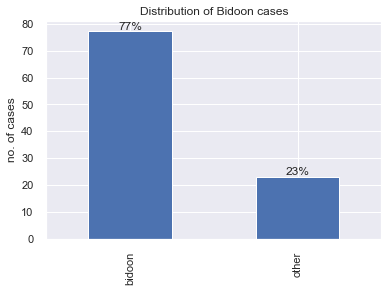
    

Yearly distribution of Bidoon cases:

    

    

Decision outcome rate for Bidoon cases:

    
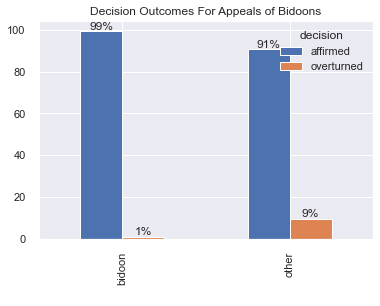
    

## Search for specific keywords (terms):

Look for `last name (efternavn)`. See how many times are they referred to in the texts.

    efternavn    12
    Name: last_name, dtype: int64

## Keyword in context (KWIC):

KWIC analysis produces a list of text fragments of equal length showing the left and right context of a keyword.

Check the context around `efternavn`. See all 18 context instances of term.

    18 random samples out of 18 contexts for 'efternavn':
    e myndigheder. Den kvindelige ansøger er ligeledes registreret som værende fra Irak og med et andet  efternavn  end meddelt de danske myndigheder. Den kvindelige ansøger har således indledningsvis til de danske 
    tivet, jf. nærmere nedenfor – anses for påfaldende, at ansøgeren ved sin ankomst til Danmark brugte  efternavn et [AB], som også er hendes nuværende irakiske ægtefælles efternavn. Sprogtesten kan ikke føre til e
    s egne oplysninger eller med oplysninger i familiens dokumenter, således at det alene er det sidste  efternavn , som adskiller sig. Disse personer har oplyst, at den mandlige ansøgers mor har boet i Irak. Hertil
    ejse i Danmark over for de danske myndigheder oplyste, at de var irakiske statsborgere, og at deres  efternavn  var [et andet end oplyst af ansøgerne senere hen]. Ansøgerne er ikke fremkommet med en rimelig fork
    er, at den kvindelige ansøger [F] ved indrejse i Grækenland er registreret som iraker med [et andet  efternavn ], og den kvindelige ansøger [G] ved indrejse i Ungarn er registreret som syrer med [et andet navn].
    fornyet afhøring i Danmark er efternavnet angivet som [D], hvilket svarer til den mandlige ansøgers  efternavn . I henhold til de græske myndigheders registreringer har hun imidlertid oplyst efternavnet [E]. Eft
    igheder. Den kvindelige ansøger har således indledningsvis til de danske myndigheder oplyst at have  efternavn et [C]. Ved fornyet afhøring i Danmark er efternavnet angivet som [D], hvilket svarer til den mandli
     venner på Facebook, der angiver at være fra Irak, herunder personen, [B], der har næsten det samme  efternavn , som ansøgeren har angivet i for-bindelse med asylansøgningen i Danmark. Det fremgår videre af Face
    er, at den kvindelige ansøger [F] ved indrejse i Grækenland er registreret som iraker med [et andet  efternavn ], og den kvindelige ansøger [G] ved indrejse i Ungarn er registreret som syrer med [et andet navn].
    eder oplyste er den mandlige ansøger således registreret som værende fra Irak og med såvel et andet  efternavn  som en anden fødselsdato end meddelt de danske myndigheder. Den kvindelige ansøger er ligeledes reg
    e ansøgers efternavn. I henhold til de græske myndigheders registreringer har hun imidlertid oplyst  efternavn et [E]. Efter en samlet vurdering kan Flygtningenævnet herefter ikke lægge til grund, at ansøgerne e
    d sin ankomst til Danmark brugte efternavnet [AB], som også er hendes nuværende irakiske ægtefælles  efternavn . Sprogtesten kan ikke føre til en anden vurdering af identitetsspørgsmålet. Ved vurderingen af ansø
    , at han er irakisk statsborger fra en bestemt navngiven by i Irak, ligesom han har oplyst et andet  efternavn  og en anden fødselsdato end opgivet til de danske myndigheder. Ansøgerens bror og dennes familie ha
    s [ansøgerens tredje barn] har forklaret, at hun udelukkende kendte faderens fornavn, […], men ikke  efternavn et. Når disse og de øvrige divergerende forklaringer sammenholdes med ansøgernes meget begrænsede ev
    er, at den kvindelige ansøger [F] ved indrejse i Grækenland er registreret som iraker med [et andet  efternavn ], og den kvindelige ansøger [G] ved indrejse i Ungarn er registreret som syrer med [et andet navn].
    mark, som han ønskede at bo i nærheden af, og at der er navnesammenfald mellem denne familie og det  efternavn , ansøgeren er registreret med i Grækenland. Der er endvidere sammenfald med familiens nationalitet 
    ingsvis til de danske myndigheder oplyst at have efternavnet [C]. Ved fornyet afhøring i Danmark er  efternavn et angivet som [D], hvilket svarer til den mandlige ansøgers efternavn. I henhold til de græske mynd
    er, at den kvindelige ansøger [F] ved indrejse i Grækenland er registreret som iraker med [et andet  efternavn ], og den kvindelige ansøger [G] ved indrejse i Ungarn er registreret som syrer med [et andet navn].

Check context around `familie`. See ten random samples.

    10 random samples out of 601 contexts for 'familie':
    e anholdt i forbindelse med demonstrationen, og der er ikke holdepunkter for at antage, at nogen af  familie medlemmerne har haft en central rolle i planlægningen eller udførelsen af hverken demonstrationen i 
     der ransagede deres bopæl, ikke bar våben, senere under samme samtale, da hun blev foreholdt andre  familie medlemmers forklaringer herom, at hun ikke kiggede på folkenes hænder. Under nævnsmødet har den kvin
    else af andre grunde kan komme på tale. Efter klagerens kortvarige ophold i Danmark, hans manglende  familie mæssige tilknytning til Danmark, oplysningerne om hans meget begrænsede tilknytning til arbejdsmarke
    nsmødet har forklaret, at hans familie ikke havde telefon, og at det var [A], der underrettede hans  familie  om ansøgerens skjulested. Den mandlige ansøgers forklaring om, at han ikke lyttede efter tolkens ov
    llem Kuwait og Irak, og ansøgeren flyttede ind hos sin fars gode venindes familie. Ansøgeren kendte  familie ns søn, [S], fra svømning og fra deres fritidsklub. Den første nat hos familien havde ansøgeren og [
    sk rohingya. Ansøgeren har til støtte for sit asylmotiv oplyst, at han flyttede fra Myanmar med sin  familie , da han var omkring fire eller fem år gammel. Familien bosatte sig i Pakistan i halvandet år, hvore
    len [i starten af] 2019 oplyst, at hun efter denne episode besluttede sig for fortsat at bo hos sin  familie , og at der ikke blev talt om sagen efterfølgende. Ansøgeren frygter ikke nogen i sin familie, hverk
    øgerens mor har forklaret indbyrdes divergerende om, hvem der angiveligt tog sig af ansøgeren efter  familie ns udrejse af Kuwait. Ansøgerens mor har til de norske udlændingemyndigheder oplyst, at ansøgeren bo
    n er syrisk statsborger og forklaret, at han ikke har dobbelt statsborgerskab. Kun en person i hans  familie , nemlig hans søster, har et jordansk pas, da hun er gift med en palæstinenser fra Jordan. Han har h
    veksling af oplysninger mellem dem selv og en lang række andre asylansøgere, som de angiveligt er i  familie  med. For så vidt angår ansøgernes forklaring om de episoder, der førte til deres udrejse, kan Flygt

Bellow we apply KWIC for `stk` keyword found from the frequency analysis and print 10 random context appearances.

The call is made to the original untokenized & unprocessed dataset.

    10 random samples out of 363 contexts for 'stk':
     bestemt dato i] 1988 blev klageren meddelt opholdstilladelse efter udlændingelovens daværende § 7,  stk . 1, nr. 1. Opholdstil-ladelsen blev [på en nærmere bestemt dato i ] 1991 gjort tidsubegrænset.  Ved
    orbud for bestandig efter udlændingelovens § 49, stk. 1, jf. § 22, nr. 1, nr. 2 og nr. 4, jf. § 32,  stk . 2, nr. 5, jf. stk. 1. [På et nærmere bestemt tidspunkt i] 2014 stadfæstede [landsretten] byrettens
    ledes heller ikke, at betingelserne for opholdstilladelse efter udlændingelovens § 7, stk. 1, eller  stk . 2, er opfyldt, stadfæster Flygtningenævnet Udlændingestyrelsens afgørelse.” Hjem/2018/59/LMD   
    jf. udlændingelovens § 7, stk. 1, eller har behov for beskyttelsesstatus, jf. udlændingelovens § 7,  stk . 2. Flygtningenævnet stadfæster derfor Udlændingestyrelsens afgørelse.” hjem/2018/27/MKT
     at inddrage klagerens opholdstilladelse i medfør af udlændingelovens § 19, stk. 2, nr. 1, og § 19,  stk . 7, 1. pkt., jf. § 26, stk. 1, idet styrelsen finder, at opholdstilladelsen er opnået ved svig. Kla
    ylmotiv, og således heller ikke, at betingelserne for opholdstilladelse efter udlændingelovens § 7,  stk . 1, eller stk. 2 er opfyldt, stadfæster Flygtningenævnet Udlændingestyrelsens afgørelse.” Hjem/2018
    ar sandsynliggjort, at betingelserne for opholdstilladelse efter udlændingelovens § 7, stk. 1 eller  stk . 2, er opfyldt.  Flygtningenævnet stadfæster derfor Udlændingestyrelsens afgørelse.” Hjem/2018/14/ 
    lse var opfyldt, idet klageren havde opnået opholdstilladelsen ved svig, jf. udlændingelovens § 11,  stk . 2, jf. § 19, stk. 2, nr. 1 og § 19, stk. 7, 1. pkt., jf. § 26, stk. 1. Klageren har som asylmotiv 
    intensitet, at disse forhold kan anses for omfattet af anvendelsesområdet for udlændingelovens § 7,  stk . 1 eller stk. 2. Tilsvarende gælder i forhold til den omstændighed, at ansøgerne er udrejst illegal
    n identitet eller sit asylmotiv til grund. Nævnet bemærker, at det følger af udlændingelovens § 40,  stk . 1, at det påhviler en asylansøger at meddele de oplysninger, som er nødvendige til en bedømmelse a

KWIC for `opholdstilladelse`.

    10 random samples out of 228 contexts for 'opholdstilladelse':
    om den pågældende er omfattet af udlændingelovens § 7. Det følger heraf, at en udlænding, der søger  opholdstilladelse  efter udlændingelovens § 7, må sandsynliggøre den identitet og det asylgrundlag, udlændingen påberå
     identitet eller sit asylmotiv, og ansøgeren har således ikke sandsynliggjort, at betingelserne for  opholdstilladelse  efter udlændingelovens § 7, stk. 1, eller stk. 2, er opfyldt. Flygtningenævnet stadfæster derfor Ud
    efter ikke, at ansøgeren har sandsynliggjort sin identitet eller asylmotiv, og at betingelserne for  opholdstilladelse  efter udlændingelovens § 7, stk. 1 eller stk. 2, er opfyldt. Flygtningenævnet stadfæster derfor Udl
     bidoons i Kuwait er således ikke af en sådan karakter, at dette i sig selv ville kunne føre til en  opholdstilladelse  i Danmark, og heller ikke oplysningerne om ansøgerens konkrete livsforhold indebærer efter oplysnin
     forhold, at ansøgeren har fremlagt dokumenter, der viser, at han er søn af sin far, der har opnået  opholdstilladelse  i England, kan heller ikke føre til en ændret vurdering. På denne baggrund finder Flygtningenævnet,
    egeringen, idet han tidligere har været tilbageholdt, fordi han ikke havde et gyldigt id-kort eller  opholdstilladelse . Ansøgeren har til støtte for sit asylmotiv oplyst, at han er født i Eritrea, hvor han voksede op h
     bidoons i Kuwait er således ikke af en sådan karakter, at dette i sig selv ville kunne føre til en  opholdstilladelse  i Danmark, og heller ikke oplysningerne om ansøgernes konkrete forhold indebærer efter oplysningern
    lovens § 7. De generelle forhold i Irak er således ikke af en sådan karakter, at dette kan føre til  opholdstilladelse  efter den nævnte bestemmelse. Flygtningenævnet stadfæster derfor Udlændingestyrelsens afgørelse for
    flere år ikke at tage kontakt til sin familie. Flygtningenævnet finder derfor, at betingelserne for  opholdstilladelse  efter udlændingelovens § 7, stk. 1 eller stk. 2, ikke er opfyldt. Flygtningenævnet stadfæster derfo
    den pågældende er omfattet af udlændingelovens § 7. Det følger heraf, at en udlænding, der søger om  opholdstilladelse  efter udlændingelovens § 7, må sandsynliggøre den identitet og det asylgrundlag, som udlændingen på

KWIC for `§ 7` keyword.

    10 random samples out of 368 contexts for '§ 7':
    n tilbagevenden til hjemlandet vil risikere forfølgelse eller overgreb omfattet af udlændingelovens  § 7 , stk. 1 eller 2. Flygtningenævnet stadfæster derfor Udlændingestyrelsens afgørelse.” Hjem2019/7/SML
    o for forfølgelse omfattet af udlændingelovens § 7, stk. 1, eller i risiko for overgreb omfattet af  § 7 , stk. 2. Flygtningenævnet stadfæster derfor Udlændingestyrelsens afgørelse.” Afgh/2019/24/MGO
    kan gives. Det følger heraf, at en udlænding, der søger om opholdstilladelse efter udlændingelovens  § 7 , må sandsynliggøre sin identitet og det asylgrundlag, han eller hun påberåber sig. Flygtningenævnet
    har sandsynliggjort sit asylmotiv. Betingelserne for opholdstilladelse i medfør af udlændingelovens  § 7 , stk. 1, eller stk. 2, er derfor ikke opfyldt. Flygtningenævnet stadfæster derfor Udlændingestyrels
    ke de generelle forhold for bidooner i Kuwait kan begrunde opholdstilladelse efter udlændingelovens  § 7 .  Det fremgår af baggrundsoplysninger om situationen for bidooner i Kuwait, at etniske bidoonere ud
    oplysninger, der er nødvendige til bedømmelse af, om den pågældende er omfattet af udlændingelovens  § 7 . Det følger heraf, at en udlænding, der søger om opholdstilladelse efter udlændingelovens § 7, må s
     forhold for bidoonere i Kuwait ville have kunnet begrunde opholdstilladelse efter udlændingelovens  § 7 . Det fremgår af baggrundsoplysninger om situationen for bidoonere i Kuwait, at etniske bidoonere ud
    e sig i en konkret og individuel risiko for forfølgelse eller overgreb omfattet af udlændingelovens  § 7 . Ansøgerne har således oplyst, at de ikke har haft konflikter ud over den af nævnet forkastede fork
    vil være i konkret og individuel risiko for forfølgelse eller overgreb omfattet af udlændingelovens  § 7 . Det af ansøgeren oplyste vedrørende hendes helbred og behov for lægebehandling kan ikke føre til e
    der er nødvendige til bedømmelse blandt andet af, om den pågældende er omfattet af udlændingelovens  § 7 . Det følger heraf, at en udlænding, der søger opholdstilladelse efter udlændingelovens § 7, må sand

## Natural Language Processing:

## Frequency analysis:

Here the most frequent tokens in the **whole** corpus are counted.

The table below presents top ten words.

<table border="1" class="dataframe">
  <thead>
    <tr style="text-align: right;">
      <th></th>
      <th>freq</th>
    </tr>
    <tr>
      <th>token</th>
      <th></th>
    </tr>
  </thead>
  <tbody>
    <tr>
      <th>ansøger</th>
      <td>3630</td>
    </tr>
    <tr>
      <th>Kuwait</th>
      <td>1370</td>
    </tr>
    <tr>
      <th>forklare</th>
      <td>1237</td>
    </tr>
    <tr>
      <th>oplyse</th>
      <td>815</td>
    </tr>
    <tr>
      <th>myndighed</th>
      <td>796</td>
    </tr>
    <tr>
      <th>mandlig</th>
      <td>794</td>
    </tr>
    <tr>
      <th>asylmotiv</th>
      <td>749</td>
    </tr>
    <tr>
      <th>forklaring</th>
      <td>675</td>
    </tr>
    <tr>
      <th>lægge</th>
      <td>649</td>
    </tr>
    <tr>
      <th>demonstration</th>
      <td>629</td>
    </tr>
  </tbody>
</table>

    
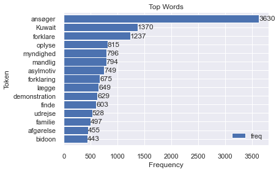
    

## N-gram analysis:

    
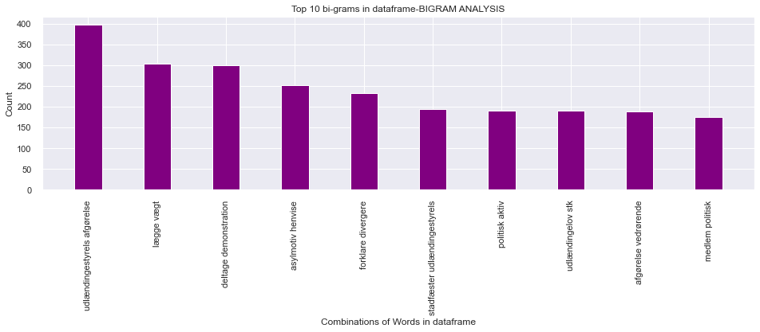
    

## TF-IDF

Below is the shape of the resulting vector of the vocabulary created from the given context.

    (189, 4312)

Ten random words from the vocabulary:

    ['stadfæste',
     '2021',
     'udlændingestyrels',
     'afgørelse',
     'vedrørende',
     'mandlig',
     'statsborger',
     'ukendt',
     'hjemland',
     'indrejst']

Peek at the IDF values array:

    array([5.55387689, 5.55387689, 3.11152986, ..., 4.63758616, 5.55387689,
           3.35665231])

<table border="1" class="dataframe">
  <thead>
    <tr style="text-align: right;">
      <th></th>
      <th>doc</th>
      <th>keywords</th>
    </tr>
  </thead>
  <tbody>
    <tr>
      <th>0</th>
      <td>stadfæste 2021 udlændingestyrels afgørelse ved...</td>
      <td>{'myanmar': 0.398, 'rohingya': 0.298, 'ansøger...</td>
    </tr>
    <tr>
      <th>1</th>
      <td>stadfæste 2021 udlændingestyrels afgørelse ved...</td>
      <td>{'algerium': 0.398, 'ansøger': 0.36, 'frankrig...</td>
    </tr>
    <tr>
      <th>2</th>
      <td>stadfæste 2021 udlændingestyrels afgørelse ved...</td>
      <td>{'ansøger': 0.323, 'sudan': 0.291, '2020': 0.2...</td>
    </tr>
    <tr>
      <th>3</th>
      <td>stadfæste 2020 udlændingestyrels afgørelse ved...</td>
      <td>{'somalia': 0.435, 'alshabaab': 0.419, 'kenya'...</td>
    </tr>
    <tr>
      <th>4</th>
      <td>hjemvise 2020 udlændingestyrels afgørelse vedr...</td>
      <td>{'eritreisk': 0.402, 'eritrea': 0.352, 'etiopi...</td>
    </tr>
    <tr>
      <th>...</th>
      <td>...</td>
      <td>...</td>
    </tr>
    <tr>
      <th>184</th>
      <td>stadfæste 2016 udlændingestyrels afgørelse ved...</td>
      <td>{'fader': 0.475, 'liyu': 0.351, 'police': 0.30...</td>
    </tr>
    <tr>
      <th>185</th>
      <td>stadfæste 2015 udlændingestyrels afgørelse ved...</td>
      <td>{'onlf': 0.436, 'police': 0.311, 'liyu': 0.311...</td>
    </tr>
    <tr>
      <th>186</th>
      <td>hjemvise 2015 udlændingestyrels afgørelse vedr...</td>
      <td>{'etiopien': 0.197, 'hjemvise': 0.188, 'foreta...</td>
    </tr>
    <tr>
      <th>187</th>
      <td>stadfæste 2015 udlændingestyrels afgørelse ved...</td>
      <td>{'soldat': 0.536, 'burmesisk': 0.216, 'burma':...</td>
    </tr>
    <tr>
      <th>188</th>
      <td>stadfæste 2015 udlændingestyrels afgørelse ved...</td>
      <td>{'algerium': 0.473, 'ukendt': 0.296, 'senest':...</td>
    </tr>
  </tbody>
</table>

189 rows × 2 columns

Twenty most common words based on TF-IDF values

    [   ('klager', 0.81),
        ('officer', 0.644),
        ('taliban', 0.575),
        ('soldat', 0.536),
        ('libyen', 0.522),
        ('police', 0.497),
        ('liyu', 0.497),
        ('ægtefælle', 0.496),
        ('senegal', 0.472),
        ('tjetjenie', 0.472),
        ('georgien', 0.472),
        ('sierra', 0.466),
        ('leone', 0.466),
        ('libysk', 0.456),
        ('avis', 0.45),
        ('holland', 0.443),
        ('hær', 0.437),
        ('somalia', 0.435),
        ('ghanesisk', 0.433),
        ('bøde', 0.426)]

Plotting the pairs:

    
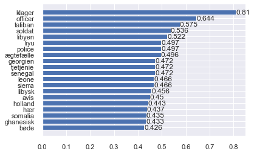
    

