# Unknown Homeland cases topic modelling:

The **data** and **text** processing steps were replicated in order to implement *Topic Modelling* in the case summaries that were categorized as Unknown Homeland. The only step that differed was in the pipeline for text processing were we dropped numbers **numbers**, too. Numbers were deemed as low value information for this specific task. So again, after checking for potential duplicates and dropping them we were left with **189** case summaries.

## Topic Modelling:

### Latent Dirichlet Allocation (LDA):

The first algorithm used for topic modelling was the probabilistic model from LDA. The second step of our analysis had to do with deciding on the **number** of topics by using the metric of coherence score. For more details on LDA and coherence score please visit the `Theory` section.

    The coherence score for LDA (0.75) was highest with 10 topics.

After building the model with the `optimal number of topics` we were able to visualize them. The numbers next to the words of each topic are the percentages with which the words contribute to the topics. These percentages of the words within a topic are a good indication for the quality of the topic model. If the percentage within a topic is rapidly decreasing, the topic is well-defined, whereas slowly decreasing word probabilities indicate a less-pronounced topic

    
    Topic 01
     dag (1.48)
     deltage (1.42)
     tage (1.41)
     demonstration (1.38)
     side (1.34)
    
    Topic 02
     demonstration (2.71)
     deltage (1.81)
     kvindelig (1.62)
     bidoon (1.61)
     dag (1.47)
    
    Topic 03
     eritrea (3.29)
     år (1.51)
     sudan (1.50)
     føde (0.99)
     tale (0.95)
    
    Topic 04
     mor (1.60)
     bopæl (1.33)
     gang (1.02)
     bidoon (0.85)
     bo (0.81)
    
    Topic 05
     divergere (2.15)
     udlænding (1.78)
     følge (1.55)
     bror (1.52)
     bidoon (1.46)
    
    Topic 06
     kvindelig (2.25)
     demonstration (2.04)
     oplysnings (1.62)
     videre (1.52)
     bopæl (1.47)
    
    Topic 07
     klager (4.42)
     opholdstilladelse (1.72)
     oplysning (1.20)
     danmark (1.15)
     navn (1.09)
    
    Topic 08
     demonstration (2.27)
     bidoon (1.55)
     udsætte (1.22)
     deltage (1.18)
     overgreb (1.02)
    
    Topic 09
     ægtefælle (6.33)
     bo (1.66)
     nærmere (1.47)
     statsborgerskab (1.46)
     angive (1.38)
    
    Topic 10
     slå (1.39)
     ihjel (1.10)
     alshabaab (1.08)
     divergere (0.99)
     udlændingestyrelse (0.99)

Below we can see a visualization the topics produced by LDA with the help of `pyLDAvis` python library. Again more details on that be found on `Theory`  section.

[lda_UH.html](../../_media/LDA_UH.html ':include :type=iframe width=100% height=800px')

### Non-Negative Matrix Factorization (NMF):

The second algorithm used was NMF a linear algebra method used to factorize the document-term-matrix.

    The coherence score for NMF (0.74) was highest with 4 topics.

Building the model with the `optimal number of topics` gives the following output:

    
    Topic 01
     demonstration (1.20)
     deltage (0.82)
     bidoon (0.81)
     dag (0.58)
     bopæl (0.53)
    
    Topic 02
     klager (13.42)
     klagere (1.77)
     opholdstilladelse (1.51)
     nr (1.14)
     svig (1.04)
    
    Topic 03
     kvindelig (2.07)
     oplysnings (1.43)
     videre (1.20)
     demonstration (1.11)
     motivsamta (1.08)
    
    Topic 04
     eritrea (5.94)
     sudan (2.68)
     eritreisk (1.54)
     etiopien (1.23)
     tigrinya (1.08)

[NMF_UH.html](../../_media/NMF_UH.html ':include :type=iframe width=100% height=800px')

### Latent Semantic Analysis/Indexing:

Another algorithm for performing topic modeling is based on the so-called singular value decomposition (SVD), another method from linear algebra.

    The coherence score for SVD (0.76) was highest with 8 topics.

Building the model with the `optimal number of topics` produces the following topics:

    
    Topic 01
     demonstration (1.12)
     kvindelig (0.71)
     bidoon (0.70)
     deltage (0.69)
     bopæl (0.56)
    
    Topic 02
     klager (27.06)
     klagere (3.58)
     opholdstilladelse (2.98)
     eritrea (2.38)
     nr (2.30)
    
    Topic 03
     kvindelig (-13.11)
     klager (-11.53)
     oplysnings (-10.46)
     motivsamta (-8.23)
     bar (-8.09)
    
    Topic 04
     eritrea (11.14)
     sudan (5.06)
     eritreisk (2.89)
     etiopien (2.33)
     tigrinya (2.04)
    
    Topic 05
     barn (-21.21)
     søn (-19.39)
     hver (-16.14)
     fald (-16.05)
     familiemedlem (-14.59)
    
    Topic 06
     bror (3.23)
     mor (3.07)
     danmark (1.91)
     følge (1.84)
     bo (1.62)
    
    Topic 07
     bror (-5.97)
     demonstration (-5.02)
     divergere (-3.22)
     udlænding (-2.91)
     foreliggende (-2.86)
    
    Topic 08
     bidoon (29.15)
     hjemland (19.67)
     overgreb (17.83)
     risiko (17.53)
     demonstration (17.20)

Unfortunately, we could not visualize the topics using `pyLDAvis` due to the fact that SVD produces negative percentages of individual word contributions.

### Kmeans clustering:

Following we tried to extract topics from the `UH dataset` using clustering techniques, such as **KMeans**. This process was implemented as an experiment and we did not make use of the findings produced in our research.

The following diagram presents the size of the clusters that **KMeans** produced. 

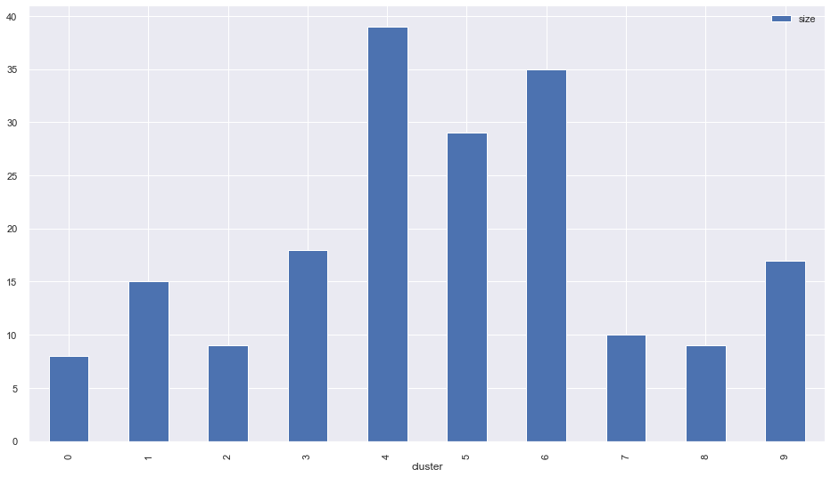

In the next section we can see a visualization of the results of KMeans clustering.

## WordClouds:

WordClouds are a popular representation of topic modelling. Compared to `pyLDAvis` they contain far less information and they are not interactive. However, WordClouds is a good enough representation and fairly intuitive.

### WordClouds produced from the LDA model:

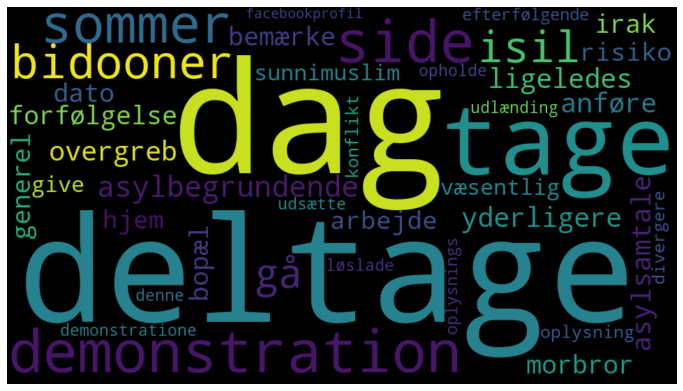

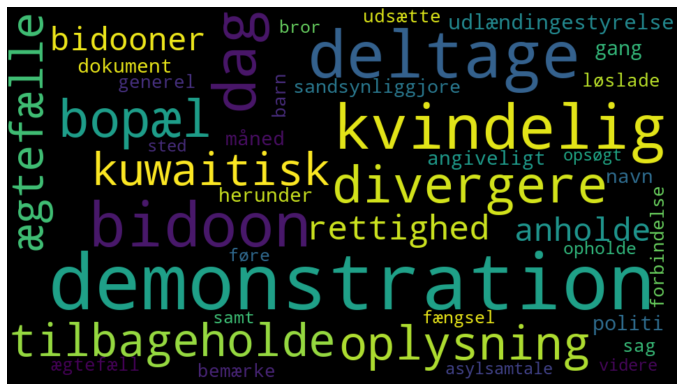
    
   
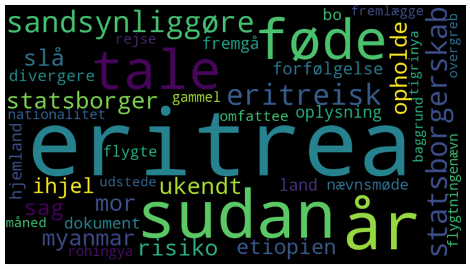
    
    
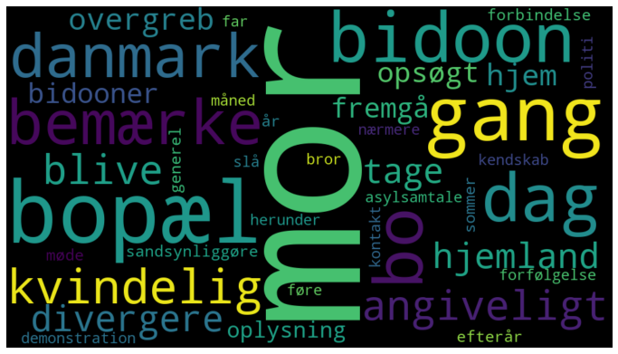
    
  
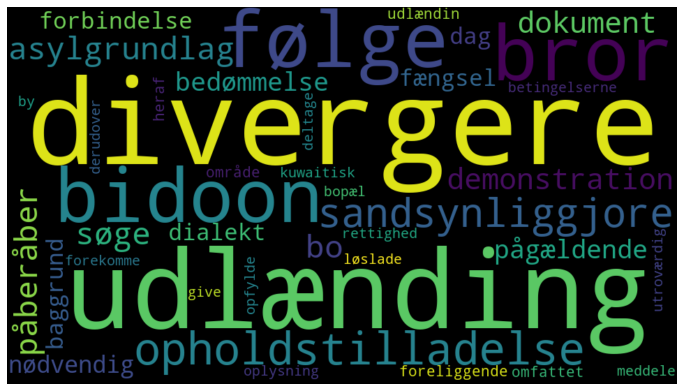
    
   
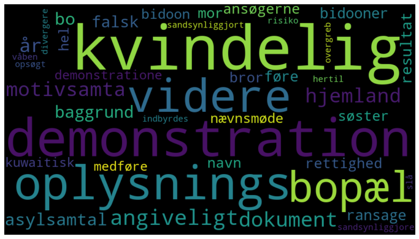
    
   
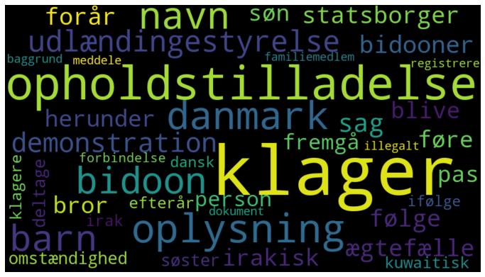
    
   
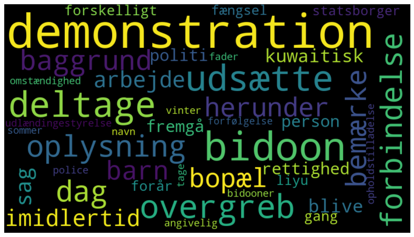
    
   
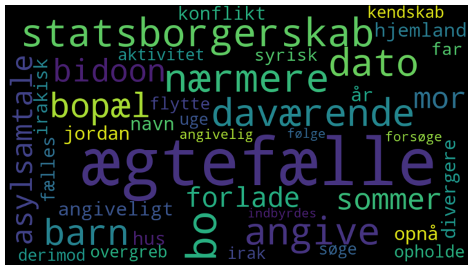
    
   
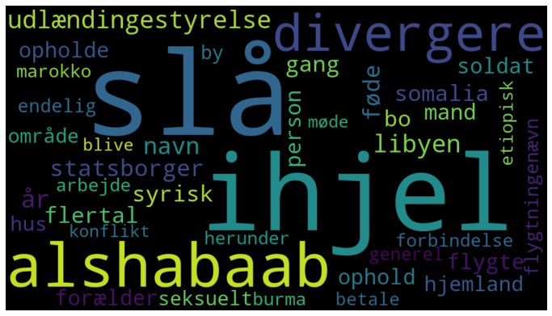
    
### WordClouds produced from the NMF model:
    
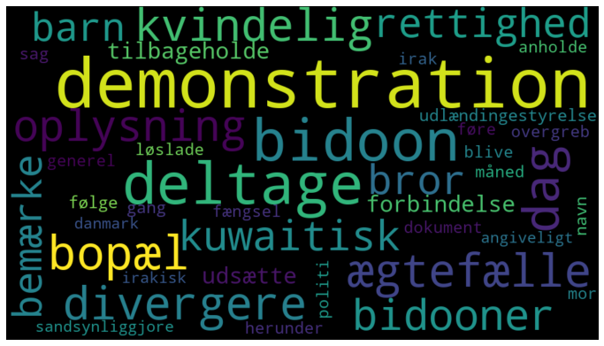
    
    
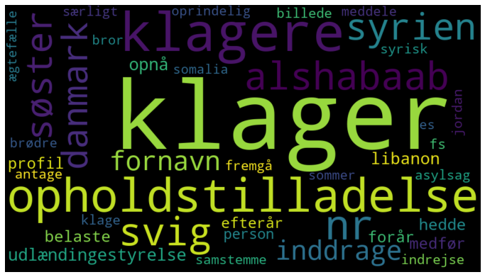
    
   
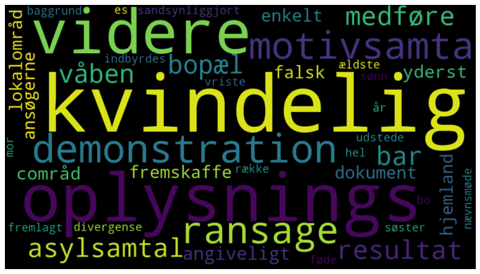
    
    
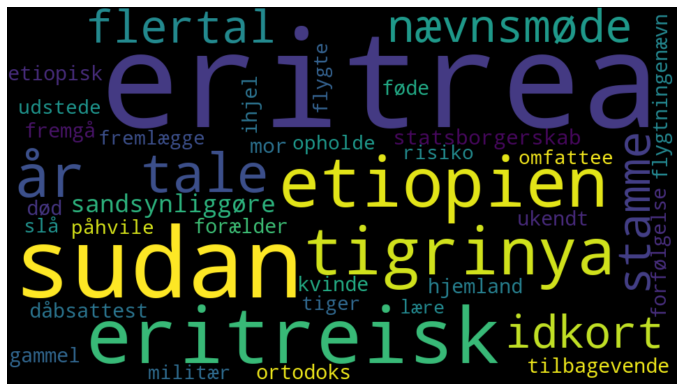
    
### WordsClouds from the SVD model:

  
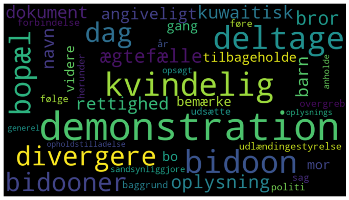
    
   
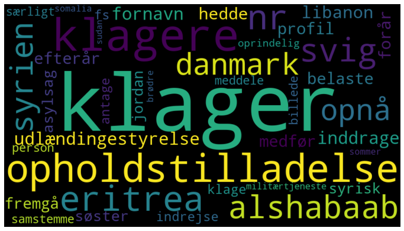
    
   
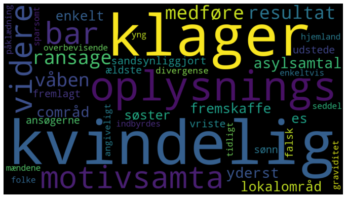
    
   
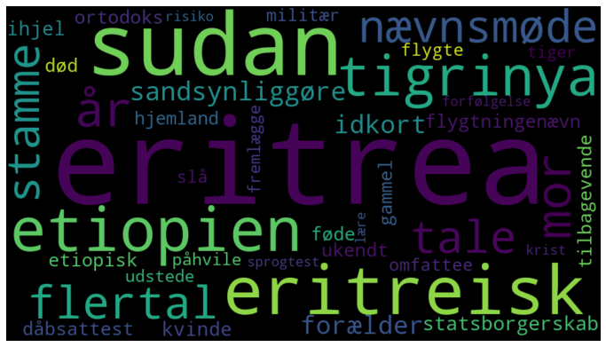
    
   
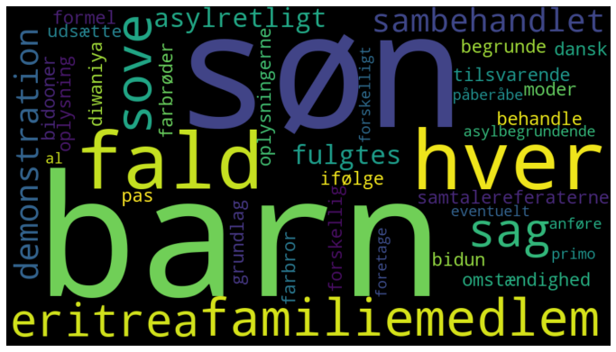
    
   
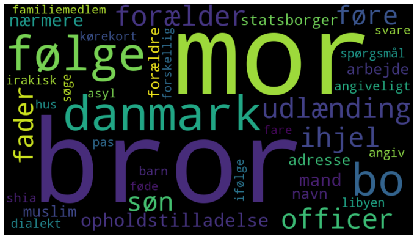
    
   
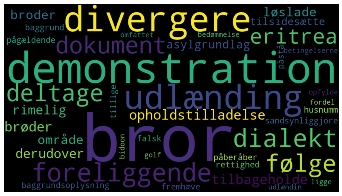
    
   
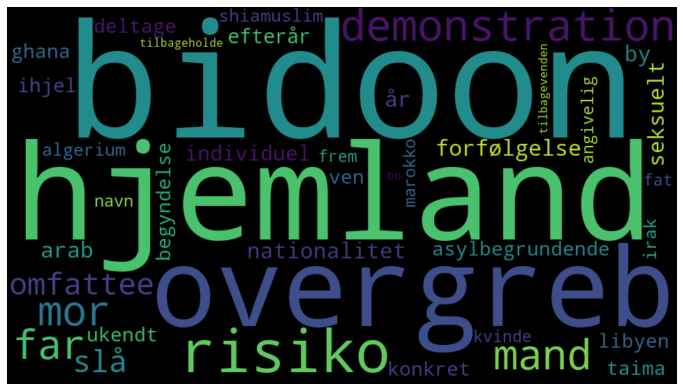
    
### WordClouds produced from Kmeans clustering:

   
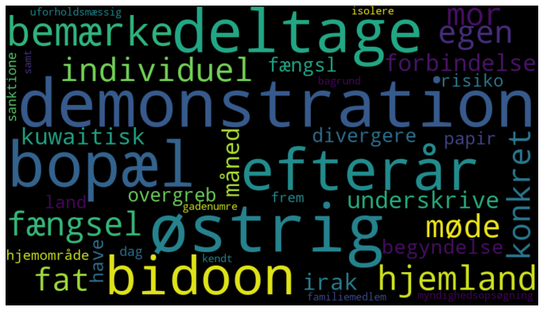
    
   
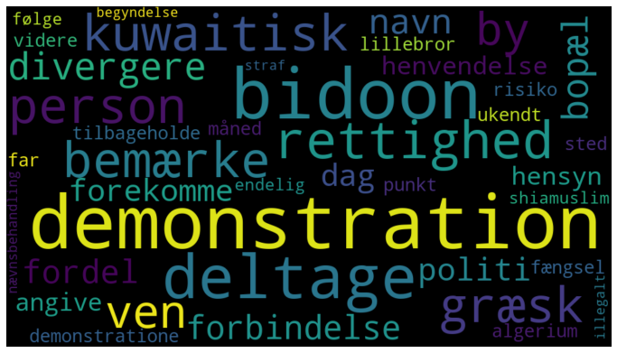
    
   
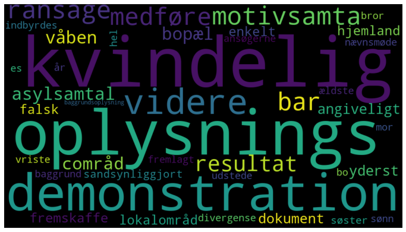
    
   
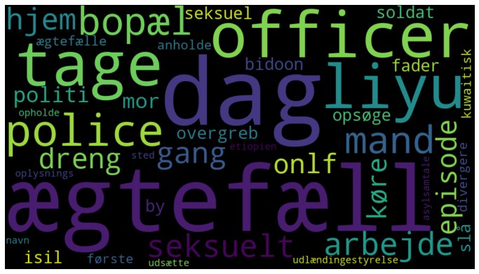
    
   
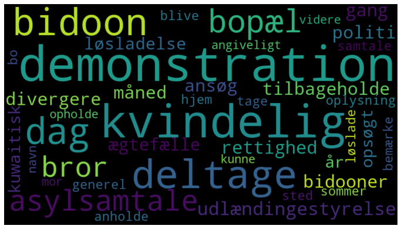
    
   
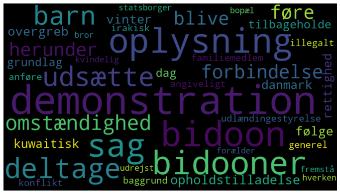
    
   
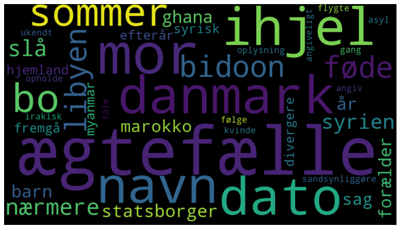
    
   
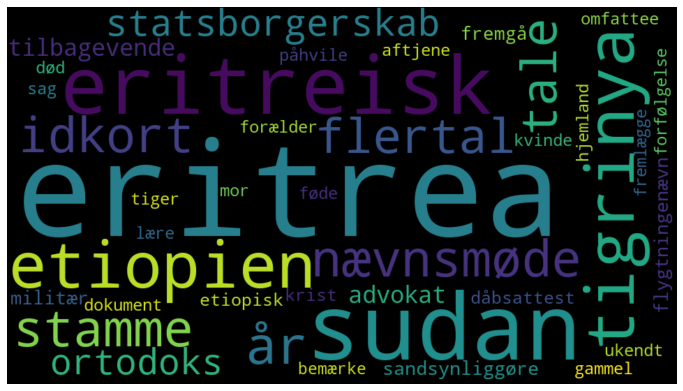
    
   
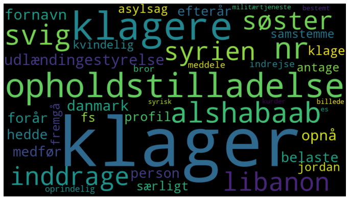
    
   
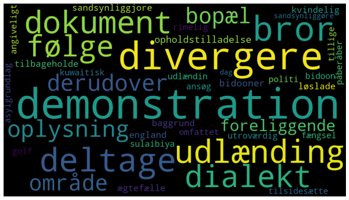