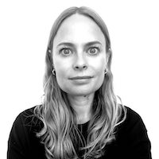

# People

Below you can see all the people involved in this research project.

Naja Holten Møller is an Assistant Professor in the Department of Computer Science, at University of Copenhagen and founder of the Confronting Data Co-Lab. Her work centers on how data-driven technologies introduce continual forms of change to public sector decision-making processes, impacting citizens and non-citizens and other stakeholders who engage with these processes.

  

 

Vasilis Vlachokyriakos is an Assistant Professor (lecturer) of Human-Computer Interaction and Digital Civics at Open Lab, Newcastle University, School of Computing and the founder of Open Lab Athens. His current work centres on designing novel socio-technical infrastructures for civic participation through place-based, participatory and action-led research, aiming at the development of systems for cooperative decision-making and service provision.

  

 

Trine Rask Nielsen is a PhD student at the Department of Computer Science at University of Copenhagen and part of the Confronting Data Co-lab. Her current work centers on in understanding the technology-supported (collaborative) work practices and workflows that support the asylum procedure and, in this context, how data about the people applying for asylum are produced, stored, and shared across asylum actors, and used to inform asylum decisions.

  

Kristin Kaltenhäuser is a PhD student at the Department of Computer Science, University of Copenhagen in the Software, Data, People and Society research section (SDPS). She has a master's degree in Software Design and Data Science, as well as in Intercultural Communication and Gender Studies. Drawing on participatory design and data science methods, her PhD is about informed sense-making of data in asylum decision-making in the Nordic countries, drawing on the experience of scholars, practitioners and policy-makers.

 

 

Tina Westergaard Milbak is a research assistant at the Department of Computer Science at University of Copenhagen and part of the Confronting Data Co-lab. Her work centers on design methodologies such as 'research through design' and speculative methods to challenge and confront dilemmas in the intersection of technology, people and society. Her practice unfolds both on a conceptual - as well as a visualizing level.

  

 

Tijs Slaats is an assistant professor at the Human-Centered Computing section of the Department of Computer Science at Copenhagen University. His main research area is the field of Business Process Management, with a particular focus on declarative and hybrid process notations. A primary goal of his research is to provide technologies that facilitate flexible workflow support for knowledge workers.

  

 

Yannis is social researcher with a statistical background. He has worked with various academic institutes and has taken part in several european research projects. His base is located at the research collective Open Lab Athens. His interests involve data science, machine learning, Human-Computer Interaction and their disruptive uses. His work focuses on equality, social justice issues, and all the ingenious ways that people invent in order to re-shape the boundaries of our realities.
 

  